# Projects and dependencies analysis

This document provides a comprehensive overview of the projects and their dependencies in the context of upgrading to .NETCoreApp,Version=v10.0.

## Table of Contents

- [Executive Summary](#executive-Summary)
  - [Highlevel Metrics](#highlevel-metrics)
  - [Projects Compatibility](#projects-compatibility)
  - [Package Compatibility](#package-compatibility)
  - [API Compatibility](#api-compatibility)
- [Aggregate NuGet packages details](#aggregate-nuget-packages-details)
- [Top API Migration Challenges](#top-api-migration-challenges)
  - [Technologies and Features](#technologies-and-features)
  - [Most Frequent API Issues](#most-frequent-api-issues)
- [Projects Relationship Graph](#projects-relationship-graph)
- [Project Details](#project-details)

  - [AI\AI.Agents.UnitTests\AI.Agents.UnitTests.csproj](#aiaiagentsunittestsaiagentsunittestscsproj)
  - [AI\AI.Agents\AI.Agents.csproj](#aiaiagentsaiagentscsproj)
  - [AI\AI.Common\AI.Common.csproj](#aiaicommonaicommoncsproj)
  - [AI\AI.Functions.UnitTests\AI.Functions.UnitTests.csproj](#aiaifunctionsunittestsaifunctionsunittestscsproj)
  - [AI\AI.Functions\AI.Functions.csproj](#aiaifunctionsaifunctionscsproj)
  - [AI\AI.Server.UnitTests\AI.Server.UnitTests.csproj](#aiaiserverunittestsaiserverunittestscsproj)
  - [AI\AI.Server\AI.Server.csproj](#aiaiserveraiservercsproj)
  - [Configuration.UnitTests\Configuration.UnitTests.csproj](#configurationunittestsconfigurationunittestscsproj)
  - [Configuration\Configuration.csproj](#configurationconfigurationcsproj)
  - [Cryptocurrency.UnitTests\Cryptocurrency.UnitTests.csproj](#cryptocurrencyunittestscryptocurrencyunittestscsproj)
  - [Cryptocurrency\Cryptocurrency.csproj](#cryptocurrencycryptocurrencycsproj)
  - [Database.UnitTests\Database.UnitTests.csproj](#databaseunittestsdatabaseunittestscsproj)
  - [Database\Database.csproj](#databasedatabasecsproj)
  - [ExternalDataProvider.UnitTests\ExternalDataProvider.UnitTests.csproj](#externaldataproviderunittestsexternaldataproviderunittestscsproj)
  - [ExternalDataProvider\ExternalDataProvider.csproj](#externaldataproviderexternaldataprovidercsproj)
  - [GhostfolioAPI.UnitTests\GhostfolioAPI.UnitTests.csproj](#ghostfolioapiunittestsghostfolioapiunittestscsproj)
  - [GhostfolioAPI\GhostfolioAPI.csproj](#ghostfolioapighostfolioapicsproj)
  - [GhostfolioSidekick.UnitTests\GhostfolioSidekick.UnitTests.csproj](#ghostfoliosidekickunittestsghostfoliosidekickunittestscsproj)
  - [GhostfolioSidekick\GhostfolioSidekick.csproj](#ghostfoliosidekickghostfoliosidekickcsproj)
  - [IntegrationTests\IntegrationTests.csproj](#integrationtestsintegrationtestscsproj)
  - [Model.UnitTests\Model.UnitTests.csproj](#modelunittestsmodelunittestscsproj)
  - [Model\Model.csproj](#modelmodelcsproj)
  - [Parsers.UnitTests\Parsers.UnitTests.csproj](#parsersunittestsparsersunittestscsproj)
  - [Parsers\Parsers.csproj](#parsersparserscsproj)
  - [PerformanceCalculations.UnitTests\PerformanceCalculations.UnitTests.csproj](#performancecalculationsunittestsperformancecalculationsunittestscsproj)
  - [PerformanceCalculations\PerformanceCalculations.csproj](#performancecalculationsperformancecalculationscsproj)
  - [PortfolioViewer\PortfolioViewer.ApiService.UnitTests\PortfolioViewer.ApiService.UnitTests.csproj](#portfolioviewerportfolioviewerapiserviceunittestsportfolioviewerapiserviceunittestscsproj)
  - [PortfolioViewer\PortfolioViewer.ApiService\PortfolioViewer.ApiService.csproj](#portfolioviewerportfolioviewerapiserviceportfolioviewerapiservicecsproj)
  - [PortfolioViewer\PortfolioViewer.AppHost\PortfolioViewer.AppHost.csproj](#portfolioviewerportfolioviewerapphostportfolioviewerapphostcsproj)
  - [PortfolioViewer\PortfolioViewer.Common\PortfolioViewer.Common.csproj](#portfolioviewerportfolioviewercommonportfolioviewercommoncsproj)
  - [PortfolioViewer\PortfolioViewer.IntegratieTests\PortfolioViewer.IntegratieTests.csproj](#portfolioviewerportfolioviewerintegratietestsportfolioviewerintegratietestscsproj)
  - [PortfolioViewer\PortfolioViewer.ServiceDefaults\PortfolioViewer.ServiceDefaults.csproj](#portfolioviewerportfolioviewerservicedefaultsportfolioviewerservicedefaultscsproj)
  - [PortfolioViewer\PortfolioViewer.Tests\PortfolioViewer.Tests.csproj](#portfolioviewerportfolioviewertestsportfolioviewertestscsproj)
  - [PortfolioViewer\PortfolioViewer.WASM.AI.UnitTests\PortfolioViewer.WASM.AI.UnitTests.csproj](#portfolioviewerportfolioviewerwasmaiunittestsportfolioviewerwasmaiunittestscsproj)
  - [PortfolioViewer\PortfolioViewer.WASM.AI\PortfolioViewer.WASM.AI.csproj](#portfolioviewerportfolioviewerwasmaiportfolioviewerwasmaicsproj)
  - [PortfolioViewer\PortfolioViewer.WASM.Data.UnitTests\PortfolioViewer.WASM.Data.UnitTests.csproj](#portfolioviewerportfolioviewerwasmdataunittestsportfolioviewerwasmdataunittestscsproj)
  - [PortfolioViewer\PortfolioViewer.WASM.Data\PortfolioViewer.WASM.Data.csproj](#portfolioviewerportfolioviewerwasmdataportfolioviewerwasmdatacsproj)
  - [PortfolioViewer\PortfolioViewer.WASM.UITests\PortfolioViewer.WASM.UITests.csproj](#portfolioviewerportfolioviewerwasmuitestsportfolioviewerwasmuitestscsproj)
  - [PortfolioViewer\PortfolioViewer.WASM.UnitTests\PortfolioViewer.WASM.UnitTests.csproj](#portfolioviewerportfolioviewerwasmunittestsportfolioviewerwasmunittestscsproj)
  - [PortfolioViewer\PortfolioViewer.WASM\PortfolioViewer.WASM.csproj](#portfolioviewerportfolioviewerwasmportfolioviewerwasmcsproj)
  - [Tools\AnonymisePDF.UnitTests\AnonymisePDF.UnitTests.csproj](#toolsanonymisepdfunittestsanonymisepdfunittestscsproj)
  - [Tools\AnonymisePDF\AnonymisePDF.csproj](#toolsanonymisepdfanonymisepdfcsproj)
  - [Tools\ScraperUtilities\ScraperUtilities.csproj](#toolsscraperutilitiesscraperutilitiescsproj)
  - [Utilities.UnitTests\Utilities.UnitTests.csproj](#utilitiesunittestsutilitiesunittestscsproj)
  - [Utilities\Utilities.csproj](#utilitiesutilitiescsproj)


## Executive Summary

### Highlevel Metrics

| Metric | Count | Status |
| :--- | :---: | :--- |
| Total Projects | 45 | All require upgrade |
| Total NuGet Packages | 84 | 21 need upgrade |
| Total Code Files | 543 |  |
| Total Code Files with Incidents | 109 |  |
| Total Lines of Code | 80990 |  |
| Total Number of Issues | 384 |  |
| Estimated LOC to modify | 281+ | at least 0,3% of codebase |

### Projects Compatibility

| Project | Target Framework | Difficulty | Package Issues | API Issues | Est. LOC Impact | Description |
| :--- | :---: | :---: | :---: | :---: | :---: | :--- |
| [AI\AI.Agents.UnitTests\AI.Agents.UnitTests.csproj](#aiaiagentsunittestsaiagentsunittestscsproj) | net9.0 | 🟢 Low | 0 | 0 |  | DotNetCoreApp, Sdk Style = True |
| [AI\AI.Agents\AI.Agents.csproj](#aiaiagentsaiagentscsproj) | net9.0 | 🟢 Low | 0 | 0 |  | ClassLibrary, Sdk Style = True |
| [AI\AI.Common\AI.Common.csproj](#aiaicommonaicommoncsproj) | net9.0 | 🟢 Low | 1 | 2 | 2+ | ClassLibrary, Sdk Style = True |
| [AI\AI.Functions.UnitTests\AI.Functions.UnitTests.csproj](#aiaifunctionsunittestsaifunctionsunittestscsproj) | net9.0 | 🟢 Low | 0 | 22 | 22+ | DotNetCoreApp, Sdk Style = True |
| [AI\AI.Functions\AI.Functions.csproj](#aiaifunctionsaifunctionscsproj) | net9.0 | 🟢 Low | 0 | 4 | 4+ | ClassLibrary, Sdk Style = True |
| [AI\AI.Server.UnitTests\AI.Server.UnitTests.csproj](#aiaiserverunittestsaiserverunittestscsproj) | net9.0 | 🟢 Low | 0 | 0 |  | DotNetCoreApp, Sdk Style = True |
| [AI\AI.Server\AI.Server.csproj](#aiaiserveraiservercsproj) | net9.0 | 🟢 Low | 0 | 6 | 6+ | DotNetCoreApp, Sdk Style = True |
| [Configuration.UnitTests\Configuration.UnitTests.csproj](#configurationunittestsconfigurationunittestscsproj) | net9.0 | 🟢 Low | 1 | 9 | 9+ | DotNetCoreApp, Sdk Style = True |
| [Configuration\Configuration.csproj](#configurationconfigurationcsproj) | net9.0 | 🟢 Low | 1 | 0 |  | ClassLibrary, Sdk Style = True |
| [Cryptocurrency.UnitTests\Cryptocurrency.UnitTests.csproj](#cryptocurrencyunittestscryptocurrencyunittestscsproj) | net9.0 | 🟢 Low | 3 | 0 |  | DotNetCoreApp, Sdk Style = True |
| [Cryptocurrency\Cryptocurrency.csproj](#cryptocurrencycryptocurrencycsproj) | net9.0 | 🟢 Low | 0 | 0 |  | ClassLibrary, Sdk Style = True |
| [Database.UnitTests\Database.UnitTests.csproj](#databaseunittestsdatabaseunittestscsproj) | net9.0 | 🟢 Low | 1 | 0 |  | DotNetCoreApp, Sdk Style = True |
| [Database\Database.csproj](#databasedatabasecsproj) | net9.0 | 🟢 Low | 3 | 0 |  | ClassLibrary, Sdk Style = True |
| [ExternalDataProvider.UnitTests\ExternalDataProvider.UnitTests.csproj](#externaldataproviderunittestsexternaldataproviderunittestscsproj) | net9.0 | 🟢 Low | 2 | 8 | 8+ | DotNetCoreApp, Sdk Style = True |
| [ExternalDataProvider\ExternalDataProvider.csproj](#externaldataproviderexternaldataprovidercsproj) | net9.0 | 🟢 Low | 1 | 2 | 2+ | ClassLibrary, Sdk Style = True |
| [GhostfolioAPI.UnitTests\GhostfolioAPI.UnitTests.csproj](#ghostfolioapiunittestsghostfolioapiunittestscsproj) | net9.0 | 🟢 Low | 3 | 0 |  | DotNetCoreApp, Sdk Style = True |
| [GhostfolioAPI\GhostfolioAPI.csproj](#ghostfolioapighostfolioapicsproj) | net9.0 | 🟢 Low | 3 | 6 | 6+ | ClassLibrary, Sdk Style = True |
| [GhostfolioSidekick.UnitTests\GhostfolioSidekick.UnitTests.csproj](#ghostfoliosidekickunittestsghostfoliosidekickunittestscsproj) | net9.0 | 🟢 Low | 3 | 9 | 9+ | DotNetCoreApp, Sdk Style = True |
| [GhostfolioSidekick\GhostfolioSidekick.csproj](#ghostfoliosidekickghostfoliosidekickcsproj) | net9.0 | 🟢 Low | 1 | 11 | 11+ | DotNetCoreApp, Sdk Style = True |
| [IntegrationTests\IntegrationTests.csproj](#integrationtestsintegrationtestscsproj) | net9.0 | 🟢 Low | 0 | 9 | 9+ | DotNetCoreApp, Sdk Style = True |
| [Model.UnitTests\Model.UnitTests.csproj](#modelunittestsmodelunittestscsproj) | net9.0 | 🟢 Low | 3 | 0 |  | DotNetCoreApp, Sdk Style = True |
| [Model\Model.csproj](#modelmodelcsproj) | net9.0 | 🟢 Low | 1 | 0 |  | ClassLibrary, Sdk Style = True |
| [Parsers.UnitTests\Parsers.UnitTests.csproj](#parsersunittestsparsersunittestscsproj) | net9.0 | 🟢 Low | 2 | 0 |  | DotNetCoreApp, Sdk Style = True |
| [Parsers\Parsers.csproj](#parsersparserscsproj) | net9.0 | 🟢 Low | 2 | 11 | 11+ | ClassLibrary, Sdk Style = True |
| [PerformanceCalculations.UnitTests\PerformanceCalculations.UnitTests.csproj](#performancecalculationsunittestsperformancecalculationsunittestscsproj) | net9.0 | 🟢 Low | 4 | 0 |  | DotNetCoreApp, Sdk Style = True |
| [PerformanceCalculations\PerformanceCalculations.csproj](#performancecalculationsperformancecalculationscsproj) | net9.0 | 🟢 Low | 0 | 0 |  | ClassLibrary, Sdk Style = True |
| [PortfolioViewer\PortfolioViewer.ApiService.UnitTests\PortfolioViewer.ApiService.UnitTests.csproj](#portfolioviewerportfolioviewerapiserviceunittestsportfolioviewerapiserviceunittestscsproj) | net9.0 | 🟢 Low | 1 | 73 | 73+ | DotNetCoreApp, Sdk Style = True |
| [PortfolioViewer\PortfolioViewer.ApiService\PortfolioViewer.ApiService.csproj](#portfolioviewerportfolioviewerapiserviceportfolioviewerapiservicecsproj) | net9.0 | 🟢 Low | 1 | 15 | 15+ | AspNetCore, Sdk Style = True |
| [PortfolioViewer\PortfolioViewer.AppHost\PortfolioViewer.AppHost.csproj](#portfolioviewerportfolioviewerapphostportfolioviewerapphostcsproj) | net9.0 | 🟢 Low | 1 | 0 |  | DotNetCoreApp, Sdk Style = True |
| [PortfolioViewer\PortfolioViewer.Common\PortfolioViewer.Common.csproj](#portfolioviewerportfolioviewercommonportfolioviewercommoncsproj) | net9.0 | 🟢 Low | 0 | 0 |  | ClassLibrary, Sdk Style = True |
| [PortfolioViewer\PortfolioViewer.IntegratieTests\PortfolioViewer.IntegratieTests.csproj](#portfolioviewerportfolioviewerintegratietestsportfolioviewerintegratietestscsproj) | net9.0 | 🟢 Low | 0 | 0 |  | DotNetCoreApp, Sdk Style = True |
| [PortfolioViewer\PortfolioViewer.ServiceDefaults\PortfolioViewer.ServiceDefaults.csproj](#portfolioviewerportfolioviewerservicedefaultsportfolioviewerservicedefaultscsproj) | net9.0 | 🟢 Low | 2 | 0 |  | ClassLibrary, Sdk Style = True |
| [PortfolioViewer\PortfolioViewer.Tests\PortfolioViewer.Tests.csproj](#portfolioviewerportfolioviewertestsportfolioviewertestscsproj) | net9.0 | 🟢 Low | 1 | 3 | 3+ | DotNetCoreApp, Sdk Style = True |
| [PortfolioViewer\PortfolioViewer.WASM.AI.UnitTests\PortfolioViewer.WASM.AI.UnitTests.csproj](#portfolioviewerportfolioviewerwasmaiunittestsportfolioviewerwasmaiunittestscsproj) | net9.0 | 🟢 Low | 2 | 22 | 22+ | DotNetCoreApp, Sdk Style = True |
| [PortfolioViewer\PortfolioViewer.WASM.AI\PortfolioViewer.WASM.AI.csproj](#portfolioviewerportfolioviewerwasmaiportfolioviewerwasmaicsproj) | net9.0 | 🟢 Low | 2 | 7 | 7+ | ClassLibrary, Sdk Style = True |
| [PortfolioViewer\PortfolioViewer.WASM.Data.UnitTests\PortfolioViewer.WASM.Data.UnitTests.csproj](#portfolioviewerportfolioviewerwasmdataunittestsportfolioviewerwasmdataunittestscsproj) | net9.0 | 🟢 Low | 1 | 0 |  | DotNetCoreApp, Sdk Style = True |
| [PortfolioViewer\PortfolioViewer.WASM.Data\PortfolioViewer.WASM.Data.csproj](#portfolioviewerportfolioviewerwasmdataportfolioviewerwasmdatacsproj) | net9.0 | 🟢 Low | 0 | 0 |  | ClassLibrary, Sdk Style = True |
| [PortfolioViewer\PortfolioViewer.WASM.UITests\PortfolioViewer.WASM.UITests.csproj](#portfolioviewerportfolioviewerwasmuitestsportfolioviewerwasmuitestscsproj) | net9.0 | 🟢 Low | 1 | 8 | 8+ | DotNetCoreApp, Sdk Style = True |
| [PortfolioViewer\PortfolioViewer.WASM.UnitTests\PortfolioViewer.WASM.UnitTests.csproj](#portfolioviewerportfolioviewerwasmunittestsportfolioviewerwasmunittestscsproj) | net9.0 | 🟢 Low | 0 | 17 | 17+ | DotNetCoreApp, Sdk Style = True |
| [PortfolioViewer\PortfolioViewer.WASM\PortfolioViewer.WASM.csproj](#portfolioviewerportfolioviewerwasmportfolioviewerwasmcsproj) | net9.0 | 🟢 Low | 5 | 28 | 28+ | AspNetCore, Sdk Style = True |
| [Tools\AnonymisePDF.UnitTests\AnonymisePDF.UnitTests.csproj](#toolsanonymisepdfunittestsanonymisepdfunittestscsproj) | net481 | 🟢 Low | 1 | 0 |  | ClassLibrary, Sdk Style = True |
| [Tools\AnonymisePDF\AnonymisePDF.csproj](#toolsanonymisepdfanonymisepdfcsproj) | net481 | 🟢 Low | 3 | 0 |  | DotNetCoreApp, Sdk Style = True |
| [Tools\ScraperUtilities\ScraperUtilities.csproj](#toolsscraperutilitiesscraperutilitiescsproj) | net9.0 | 🟢 Low | 2 | 8 | 8+ | DotNetCoreApp, Sdk Style = True |
| [Utilities.UnitTests\Utilities.UnitTests.csproj](#utilitiesunittestsutilitiesunittestscsproj) | net9.0 | 🟢 Low | 0 | 0 |  | DotNetCoreApp, Sdk Style = True |
| [Utilities\Utilities.csproj](#utilitiesutilitiescsproj) | net9.0 | 🟢 Low | 0 | 1 | 1+ | ClassLibrary, Sdk Style = True |

### Package Compatibility

| Status | Count | Percentage |
| :--- | :---: | :---: |
| ✅ Compatible | 63 | 75,0% |
| ⚠️ Incompatible | 1 | 1,2% |
| 🔄 Upgrade Recommended | 20 | 23,8% |
| ***Total NuGet Packages*** | ***84*** | ***100%*** |

### API Compatibility

| Category | Count | Impact |
| :--- | :---: | :--- |
| 🔴 Binary Incompatible | 2 | High - Require code changes |
| 🟡 Source Incompatible | 55 | Medium - Needs re-compilation and potential conflicting API error fixing |
| 🔵 Behavioral change | 224 | Low - Behavioral changes that may require testing at runtime |
| ✅ Compatible | 165169 |  |
| ***Total APIs Analyzed*** | ***165450*** |  |

## Aggregate NuGet packages details

| Package | Current Version | Suggested Version | Projects | Description |
| :--- | :---: | :---: | :--- | :--- |
| Aspire.Hosting.AppHost | 13.0.1 | 13.0.2 | [PortfolioViewer.AppHost.csproj](#portfolioviewerportfolioviewerapphostportfolioviewerapphostcsproj) | NuGet package upgrade is recommended |
| Aspire.Hosting.Testing | 13.0.1 | 13.0.2 | [PortfolioViewer.Tests.csproj](#portfolioviewerportfolioviewertestsportfolioviewertestscsproj) | NuGet package upgrade is recommended |
| Aspire4Wasm.AppHost | 6.0.0 |  | [PortfolioViewer.AppHost.csproj](#portfolioviewerportfolioviewerapphostportfolioviewerapphostcsproj) | ✅Compatible |
| AutoFixture | 4.18.1 |  | [Cryptocurrency.UnitTests.csproj](#cryptocurrencyunittestscryptocurrencyunittestscsproj)<br/>[GhostfolioAPI.UnitTests.csproj](#ghostfolioapiunittestsghostfolioapiunittestscsproj)<br/>[GhostfolioSidekick.UnitTests.csproj](#ghostfoliosidekickunittestsghostfoliosidekickunittestscsproj)<br/>[Model.UnitTests.csproj](#modelunittestsmodelunittestscsproj)<br/>[Parsers.UnitTests.csproj](#parsersunittestsparsersunittestscsproj)<br/>[PerformanceCalculations.UnitTests.csproj](#performancecalculationsunittestsperformancecalculationsunittestscsproj) | ✅Compatible |
| AutoFixture.Xunit2 | 4.18.1 |  | [Parsers.UnitTests.csproj](#parsersunittestsparsersunittestscsproj) | ✅Compatible |
| AwesomeAssertions | 9.3.0 |  | [AnonymisePDF.UnitTests.csproj](#toolsanonymisepdfunittestsanonymisepdfunittestscsproj)<br/>[Configuration.UnitTests.csproj](#configurationunittestsconfigurationunittestscsproj)<br/>[Cryptocurrency.UnitTests.csproj](#cryptocurrencyunittestscryptocurrencyunittestscsproj)<br/>[Database.UnitTests.csproj](#databaseunittestsdatabaseunittestscsproj)<br/>[ExternalDataProvider.UnitTests.csproj](#externaldataproviderunittestsexternaldataproviderunittestscsproj)<br/>[GhostfolioAPI.UnitTests.csproj](#ghostfolioapiunittestsghostfolioapiunittestscsproj)<br/>[GhostfolioSidekick.UnitTests.csproj](#ghostfoliosidekickunittestsghostfoliosidekickunittestscsproj)<br/>[IntegrationTests.csproj](#integrationtestsintegrationtestscsproj)<br/>[Model.UnitTests.csproj](#modelunittestsmodelunittestscsproj)<br/>[Parsers.UnitTests.csproj](#parsersunittestsparsersunittestscsproj)<br/>[PerformanceCalculations.UnitTests.csproj](#performancecalculationsunittestsperformancecalculationsunittestscsproj)<br/>[PortfolioViewer.ApiService.UnitTests.csproj](#portfolioviewerportfolioviewerapiserviceunittestsportfolioviewerapiserviceunittestscsproj)<br/>[PortfolioViewer.Tests.csproj](#portfolioviewerportfolioviewertestsportfolioviewertestscsproj)<br/>[PortfolioViewer.WASM.AI.UnitTests.csproj](#portfolioviewerportfolioviewerwasmaiunittestsportfolioviewerwasmaiunittestscsproj)<br/>[PortfolioViewer.WASM.Data.UnitTests.csproj](#portfolioviewerportfolioviewerwasmdataunittestsportfolioviewerwasmdataunittestscsproj)<br/>[PortfolioViewer.WASM.UnitTests.csproj](#portfolioviewerportfolioviewerwasmunittestsportfolioviewerwasmunittestscsproj) | ✅Compatible |
| Bit.Besql | 10.1.1 |  | [PortfolioViewer.WASM.csproj](#portfolioviewerportfolioviewerwasmportfolioviewerwasmcsproj) | ✅Compatible |
| BouncyCastle.Cryptography | 2.6.2 |  | [AnonymisePDF.csproj](#toolsanonymisepdfanonymisepdfcsproj)<br/>[AnonymisePDF.UnitTests.csproj](#toolsanonymisepdfunittestsanonymisepdfunittestscsproj) | ✅Compatible |
| bunit | 2.1.1 |  | [PortfolioViewer.WASM.UnitTests.csproj](#portfolioviewerportfolioviewerwasmunittestsportfolioviewerwasmunittestscsproj) | ✅Compatible |
| CoinGecko.Net | 4.12.0 |  | [ExternalDataProvider.csproj](#externaldataproviderexternaldataprovidercsproj) | ✅Compatible |
| CompareNETObjects | 4.84.0 |  | [Database.csproj](#databasedatabasecsproj) | ✅Compatible |
| coverlet.collector | 6.0.2 |  | [Utilities.UnitTests.csproj](#utilitiesunittestsutilitiesunittestscsproj) | ✅Compatible |
| coverlet.collector | 6.0.4 |  | [AI.Agents.UnitTests.csproj](#aiaiagentsunittestsaiagentsunittestscsproj)<br/>[AI.Functions.UnitTests.csproj](#aiaifunctionsunittestsaifunctionsunittestscsproj)<br/>[AI.Server.UnitTests.csproj](#aiaiserverunittestsaiserverunittestscsproj)<br/>[AnonymisePDF.UnitTests.csproj](#toolsanonymisepdfunittestsanonymisepdfunittestscsproj)<br/>[Configuration.UnitTests.csproj](#configurationunittestsconfigurationunittestscsproj)<br/>[Cryptocurrency.UnitTests.csproj](#cryptocurrencyunittestscryptocurrencyunittestscsproj)<br/>[Database.UnitTests.csproj](#databaseunittestsdatabaseunittestscsproj)<br/>[ExternalDataProvider.UnitTests.csproj](#externaldataproviderunittestsexternaldataproviderunittestscsproj)<br/>[GhostfolioAPI.UnitTests.csproj](#ghostfolioapiunittestsghostfolioapiunittestscsproj)<br/>[GhostfolioSidekick.UnitTests.csproj](#ghostfoliosidekickunittestsghostfoliosidekickunittestscsproj)<br/>[IntegrationTests.csproj](#integrationtestsintegrationtestscsproj)<br/>[Model.UnitTests.csproj](#modelunittestsmodelunittestscsproj)<br/>[Parsers.UnitTests.csproj](#parsersunittestsparsersunittestscsproj)<br/>[PerformanceCalculations.UnitTests.csproj](#performancecalculationsunittestsperformancecalculationsunittestscsproj)<br/>[PortfolioViewer.ApiService.UnitTests.csproj](#portfolioviewerportfolioviewerapiserviceunittestsportfolioviewerapiserviceunittestscsproj)<br/>[PortfolioViewer.IntegratieTests.csproj](#portfolioviewerportfolioviewerintegratietestsportfolioviewerintegratietestscsproj)<br/>[PortfolioViewer.Tests.csproj](#portfolioviewerportfolioviewertestsportfolioviewertestscsproj)<br/>[PortfolioViewer.WASM.AI.UnitTests.csproj](#portfolioviewerportfolioviewerwasmaiunittestsportfolioviewerwasmaiunittestscsproj)<br/>[PortfolioViewer.WASM.Data.UnitTests.csproj](#portfolioviewerportfolioviewerwasmdataunittestsportfolioviewerwasmdataunittestscsproj)<br/>[PortfolioViewer.WASM.UITests.csproj](#portfolioviewerportfolioviewerwasmuitestsportfolioviewerwasmuitestscsproj)<br/>[PortfolioViewer.WASM.UnitTests.csproj](#portfolioviewerportfolioviewerwasmunittestsportfolioviewerwasmunittestscsproj) | ✅Compatible |
| CsvHelper | 33.1.0 |  | [Parsers.csproj](#parsersparserscsproj) | ✅Compatible |
| Fastenshtein | 1.0.11 |  | [Utilities.csproj](#utilitiesutilitiescsproj) | ✅Compatible |
| FuzzySharp | 2.0.2 |  | [GhostfolioAPI.csproj](#ghostfolioapighostfolioapicsproj) | ✅Compatible |
| Google.Protobuf | 3.33.1 |  | [PortfolioViewer.WASM.csproj](#portfolioviewerportfolioviewerwasmportfolioviewerwasmcsproj) | ✅Compatible |
| Grpc.AspNetCore | 2.71.0 |  | [PortfolioViewer.ApiService.csproj](#portfolioviewerportfolioviewerapiserviceportfolioviewerapiservicecsproj) | ✅Compatible |
| Grpc.AspNetCore.Web | 2.71.0 |  | [PortfolioViewer.ApiService.csproj](#portfolioviewerportfolioviewerapiserviceportfolioviewerapiservicecsproj) | ✅Compatible |
| Grpc.Net.Client | 2.71.0 |  | [PortfolioViewer.WASM.csproj](#portfolioviewerportfolioviewerwasmportfolioviewerwasmcsproj) | ✅Compatible |
| Grpc.Net.Client.Web | 2.71.0 |  | [PortfolioViewer.WASM.csproj](#portfolioviewerportfolioviewerwasmportfolioviewerwasmcsproj) | ✅Compatible |
| Grpc.Tools | 2.76.0 |  | [PortfolioViewer.WASM.csproj](#portfolioviewerportfolioviewerwasmportfolioviewerwasmcsproj) | ✅Compatible |
| HtmlAgilityPack | 1.12.4 |  | [ExternalDataProvider.csproj](#externaldataproviderexternaldataprovidercsproj)<br/>[PortfolioViewer.ApiService.csproj](#portfolioviewerportfolioviewerapiserviceportfolioviewerapiservicecsproj) | ✅Compatible |
| ILogger.Moq | 2.0.0 |  | [GhostfolioAPI.UnitTests.csproj](#ghostfolioapiunittestsghostfolioapiunittestscsproj)<br/>[GhostfolioSidekick.UnitTests.csproj](#ghostfoliosidekickunittestsghostfoliosidekickunittestscsproj) | ✅Compatible |
| itext | 9.4.0 |  | [Parsers.csproj](#parsersparserscsproj) | ✅Compatible |
| itext.bouncy-castle-adapter | 9.4.0 |  | [AnonymisePDF.csproj](#toolsanonymisepdfanonymisepdfcsproj) | ✅Compatible |
| itext.pdfsweep | 5.0.4 |  | [AnonymisePDF.csproj](#toolsanonymisepdfanonymisepdfcsproj) | ⚠️NuGet package is incompatible |
| LLamaSharp | 0.25.0 |  | [AI.Server.csproj](#aiaiserveraiservercsproj) | ✅Compatible |
| LLamaSharp.Backend.Cpu | 0.25.0 |  | [AI.Server.csproj](#aiaiserveraiservercsproj) | ✅Compatible |
| LLamaSharp.Backend.Vulkan | 0.25.0 |  | [AI.Server.csproj](#aiaiserveraiservercsproj) | ✅Compatible |
| LLamaSharp.semantic-kernel | 0.25.0 |  | [AI.Server.csproj](#aiaiserveraiservercsproj) | ✅Compatible |
| Markdig | 0.44.0 |  | [PortfolioViewer.WASM.csproj](#portfolioviewerportfolioviewerwasmportfolioviewerwasmcsproj) | ✅Compatible |
| Microsoft.AspNetCore.Components.WebAssembly | 9.0.11 | 10.0.1 | [PortfolioViewer.WASM.AI.csproj](#portfolioviewerportfolioviewerwasmaiportfolioviewerwasmaicsproj)<br/>[PortfolioViewer.WASM.AI.UnitTests.csproj](#portfolioviewerportfolioviewerwasmaiunittestsportfolioviewerwasmaiunittestscsproj)<br/>[PortfolioViewer.WASM.csproj](#portfolioviewerportfolioviewerwasmportfolioviewerwasmcsproj) | NuGet package upgrade is recommended |
| Microsoft.AspNetCore.Components.WebAssembly.Authentication | 9.0.11 | 10.0.1 | [PortfolioViewer.WASM.csproj](#portfolioviewerportfolioviewerwasmportfolioviewerwasmcsproj) | NuGet package upgrade is recommended |
| Microsoft.AspNetCore.Components.WebAssembly.DevServer | 10.0.0 | 10.0.1 | [PortfolioViewer.WASM.csproj](#portfolioviewerportfolioviewerwasmportfolioviewerwasmcsproj) | NuGet package upgrade is recommended |
| Microsoft.AspNetCore.Mvc.Testing | 9.0.11 | 10.0.1 | [PortfolioViewer.ApiService.UnitTests.csproj](#portfolioviewerportfolioviewerapiserviceunittestsportfolioviewerapiserviceunittestscsproj)<br/>[PortfolioViewer.WASM.UITests.csproj](#portfolioviewerportfolioviewerwasmuitestsportfolioviewerwasmuitestscsproj) | NuGet package upgrade is recommended |
| Microsoft.AspNetCore.OpenApi | 9.0.11 | 10.0.1 | [PortfolioViewer.ApiService.csproj](#portfolioviewerportfolioviewerapiserviceportfolioviewerapiservicecsproj) | NuGet package upgrade is recommended |
| Microsoft.EntityFrameworkCore.InMemory | 9.0.11 | 10.0.1 | [ExternalDataProvider.UnitTests.csproj](#externaldataproviderunittestsexternaldataproviderunittestscsproj)<br/>[GhostfolioSidekick.UnitTests.csproj](#ghostfoliosidekickunittestsghostfoliosidekickunittestscsproj)<br/>[PortfolioViewer.WASM.Data.UnitTests.csproj](#portfolioviewerportfolioviewerwasmdataunittestsportfolioviewerwasmdataunittestscsproj) | NuGet package upgrade is recommended |
| Microsoft.EntityFrameworkCore.Proxies | 9.0.11 | 10.0.1 | [Database.csproj](#databasedatabasecsproj) | NuGet package upgrade is recommended |
| Microsoft.EntityFrameworkCore.Sqlite | 9.0.11 | 10.0.1 | [Database.csproj](#databasedatabasecsproj)<br/>[PerformanceCalculations.UnitTests.csproj](#performancecalculationsunittestsperformancecalculationsunittestscsproj) | NuGet package upgrade is recommended |
| Microsoft.EntityFrameworkCore.Tools | 9.0.11 | 10.0.1 | [Database.csproj](#databasedatabasecsproj) | NuGet package upgrade is recommended |
| Microsoft.Extensions.AI.Abstractions | 9.10.2 |  | [AI.Common.csproj](#aiaicommonaicommoncsproj)<br/>[PortfolioViewer.WASM.AI.csproj](#portfolioviewerportfolioviewerwasmaiportfolioviewerwasmaicsproj)<br/>[PortfolioViewer.WASM.AI.UnitTests.csproj](#portfolioviewerportfolioviewerwasmaiunittestsportfolioviewerwasmaiunittestscsproj) | ✅Compatible |
| Microsoft.Extensions.Caching.Memory | 9.0.11 | 10.0.1 | [GhostfolioAPI.csproj](#ghostfolioapighostfolioapicsproj) | NuGet package upgrade is recommended |
| Microsoft.Extensions.DependencyInjection.Abstractions | 9.0.11 | 10.0.1 | [AI.Common.csproj](#aiaicommonaicommoncsproj)<br/>[PortfolioViewer.WASM.AI.csproj](#portfolioviewerportfolioviewerwasmaiportfolioviewerwasmaicsproj) | NuGet package upgrade is recommended |
| Microsoft.Extensions.Hosting | 9.0.11 | 10.0.1 | [GhostfolioSidekick.csproj](#ghostfoliosidekickghostfoliosidekickcsproj)<br/>[ScraperUtilities.csproj](#toolsscraperutilitiesscraperutilitiescsproj) | NuGet package upgrade is recommended |
| Microsoft.Extensions.Hosting.Abstractions | 9.0.11 | 10.0.1 | [ScraperUtilities.csproj](#toolsscraperutilitiesscraperutilitiescsproj) | NuGet package upgrade is recommended |
| Microsoft.Extensions.Http.Resilience | 9.10.0 | 10.1.0 | [AI.Agents.csproj](#aiaiagentsaiagentscsproj)<br/>[PortfolioViewer.ServiceDefaults.csproj](#portfolioviewerportfolioviewerservicedefaultsportfolioviewerservicedefaultscsproj) | NuGet package upgrade is recommended |
| Microsoft.Extensions.Logging | 9.0.11 | 10.0.1 | [AnonymisePDF.csproj](#toolsanonymisepdfanonymisepdfcsproj)<br/>[AnonymisePDF.UnitTests.csproj](#toolsanonymisepdfunittestsanonymisepdfunittestscsproj)<br/>[Configuration.UnitTests.csproj](#configurationunittestsconfigurationunittestscsproj)<br/>[Cryptocurrency.UnitTests.csproj](#cryptocurrencyunittestscryptocurrencyunittestscsproj)<br/>[Database.UnitTests.csproj](#databaseunittestsdatabaseunittestscsproj)<br/>[ExternalDataProvider.csproj](#externaldataproviderexternaldataprovidercsproj)<br/>[ExternalDataProvider.UnitTests.csproj](#externaldataproviderunittestsexternaldataproviderunittestscsproj)<br/>[GhostfolioAPI.csproj](#ghostfolioapighostfolioapicsproj)<br/>[GhostfolioAPI.UnitTests.csproj](#ghostfolioapiunittestsghostfolioapiunittestscsproj)<br/>[GhostfolioSidekick.UnitTests.csproj](#ghostfoliosidekickunittestsghostfoliosidekickunittestscsproj)<br/>[Model.UnitTests.csproj](#modelunittestsmodelunittestscsproj)<br/>[Parsers.csproj](#parsersparserscsproj)<br/>[Parsers.UnitTests.csproj](#parsersunittestsparsersunittestscsproj)<br/>[PerformanceCalculations.UnitTests.csproj](#performancecalculationsunittestsperformancecalculationsunittestscsproj) | NuGet package upgrade is recommended |
| Microsoft.Extensions.Logging.Abstractions | 9.0.11 | 10.0.1 | [AnonymisePDF.csproj](#toolsanonymisepdfanonymisepdfcsproj)<br/>[Configuration.csproj](#configurationconfigurationcsproj)<br/>[GhostfolioAPI.csproj](#ghostfolioapighostfolioapicsproj)<br/>[Parsers.csproj](#parsersparserscsproj)<br/>[PortfolioViewer.WASM.AI.UnitTests.csproj](#portfolioviewerportfolioviewerwasmaiunittestsportfolioviewerwasmaiunittestscsproj) | NuGet package upgrade is recommended |
| Microsoft.Extensions.ServiceDiscovery | 9.5.2 | 10.1.0 | [PortfolioViewer.ServiceDefaults.csproj](#portfolioviewerportfolioviewerservicedefaultsportfolioviewerservicedefaultscsproj)<br/>[PortfolioViewer.WASM.csproj](#portfolioviewerportfolioviewerwasmportfolioviewerwasmcsproj) | NuGet package upgrade is recommended |
| Microsoft.NET.ILLink.Tasks | 9.0.11 | 10.0.1 | [PortfolioViewer.WASM.csproj](#portfolioviewerportfolioviewerwasmportfolioviewerwasmcsproj) | NuGet package upgrade is recommended |
| Microsoft.NET.Sdk.WebAssembly.Pack | 9.0.11 |  | [PortfolioViewer.WASM.csproj](#portfolioviewerportfolioviewerwasmportfolioviewerwasmcsproj) | ✅Compatible |
| Microsoft.NET.Test.Sdk | 17.12.0 |  | [Utilities.UnitTests.csproj](#utilitiesunittestsutilitiesunittestscsproj) | ✅Compatible |
| Microsoft.NET.Test.Sdk | 18.0.1 |  | [AI.Agents.UnitTests.csproj](#aiaiagentsunittestsaiagentsunittestscsproj)<br/>[AI.Functions.UnitTests.csproj](#aiaifunctionsunittestsaifunctionsunittestscsproj)<br/>[AI.Server.UnitTests.csproj](#aiaiserverunittestsaiserverunittestscsproj)<br/>[AnonymisePDF.UnitTests.csproj](#toolsanonymisepdfunittestsanonymisepdfunittestscsproj)<br/>[Configuration.UnitTests.csproj](#configurationunittestsconfigurationunittestscsproj)<br/>[Cryptocurrency.UnitTests.csproj](#cryptocurrencyunittestscryptocurrencyunittestscsproj)<br/>[Database.UnitTests.csproj](#databaseunittestsdatabaseunittestscsproj)<br/>[ExternalDataProvider.UnitTests.csproj](#externaldataproviderunittestsexternaldataproviderunittestscsproj)<br/>[GhostfolioAPI.UnitTests.csproj](#ghostfolioapiunittestsghostfolioapiunittestscsproj)<br/>[GhostfolioSidekick.UnitTests.csproj](#ghostfoliosidekickunittestsghostfoliosidekickunittestscsproj)<br/>[IntegrationTests.csproj](#integrationtestsintegrationtestscsproj)<br/>[Model.UnitTests.csproj](#modelunittestsmodelunittestscsproj)<br/>[Parsers.UnitTests.csproj](#parsersunittestsparsersunittestscsproj)<br/>[PerformanceCalculations.UnitTests.csproj](#performancecalculationsunittestsperformancecalculationsunittestscsproj)<br/>[PortfolioViewer.ApiService.UnitTests.csproj](#portfolioviewerportfolioviewerapiserviceunittestsportfolioviewerapiserviceunittestscsproj)<br/>[PortfolioViewer.IntegratieTests.csproj](#portfolioviewerportfolioviewerintegratietestsportfolioviewerintegratietestscsproj)<br/>[PortfolioViewer.Tests.csproj](#portfolioviewerportfolioviewertestsportfolioviewertestscsproj)<br/>[PortfolioViewer.WASM.AI.UnitTests.csproj](#portfolioviewerportfolioviewerwasmaiunittestsportfolioviewerwasmaiunittestscsproj)<br/>[PortfolioViewer.WASM.Data.UnitTests.csproj](#portfolioviewerportfolioviewerwasmdataunittestsportfolioviewerwasmdataunittestscsproj)<br/>[PortfolioViewer.WASM.UITests.csproj](#portfolioviewerportfolioviewerwasmuitestsportfolioviewerwasmuitestscsproj)<br/>[PortfolioViewer.WASM.UnitTests.csproj](#portfolioviewerportfolioviewerwasmunittestsportfolioviewerwasmunittestscsproj) | ✅Compatible |
| Microsoft.Playwright | 1.56.0 |  | [PortfolioViewer.IntegratieTests.csproj](#portfolioviewerportfolioviewerintegratietestsportfolioviewerintegratietestscsproj)<br/>[PortfolioViewer.WASM.UITests.csproj](#portfolioviewerportfolioviewerwasmuitestsportfolioviewerwasmuitestscsproj)<br/>[ScraperUtilities.csproj](#toolsscraperutilitiesscraperutilitiescsproj) | ✅Compatible |
| Microsoft.SemanticKernel | 1.67.1 |  | [AI.Common.csproj](#aiaicommonaicommoncsproj)<br/>[AI.Functions.UnitTests.csproj](#aiaifunctionsunittestsaifunctionsunittestscsproj)<br/>[PortfolioViewer.WASM.AI.csproj](#portfolioviewerportfolioviewerwasmaiportfolioviewerwasmaicsproj)<br/>[PortfolioViewer.WASM.AI.UnitTests.csproj](#portfolioviewerportfolioviewerwasmaiunittestsportfolioviewerwasmaiunittestscsproj) | ✅Compatible |
| Microsoft.SemanticKernel.Agents.Abstractions | 1.67.1 |  | [AI.Common.csproj](#aiaicommonaicommoncsproj)<br/>[PortfolioViewer.WASM.AI.csproj](#portfolioviewerportfolioviewerwasmaiportfolioviewerwasmaicsproj) | ✅Compatible |
| Microsoft.SemanticKernel.Agents.Core | 1.67.1 |  | [AI.Common.csproj](#aiaicommonaicommoncsproj)<br/>[PortfolioViewer.WASM.AI.csproj](#portfolioviewerportfolioviewerwasmaiportfolioviewerwasmaicsproj) | ✅Compatible |
| Microsoft.TypeScript.MSBuild | 5.9.3 |  | [PortfolioViewer.WASM.csproj](#portfolioviewerportfolioviewerwasmportfolioviewerwasmcsproj) | ✅Compatible |
| Moq | 4.20.72 |  | [AI.Agents.UnitTests.csproj](#aiaiagentsunittestsaiagentsunittestscsproj)<br/>[AI.Functions.UnitTests.csproj](#aiaifunctionsunittestsaifunctionsunittestscsproj)<br/>[Configuration.UnitTests.csproj](#configurationunittestsconfigurationunittestscsproj)<br/>[Database.UnitTests.csproj](#databaseunittestsdatabaseunittestscsproj)<br/>[ExternalDataProvider.UnitTests.csproj](#externaldataproviderunittestsexternaldataproviderunittestscsproj)<br/>[GhostfolioAPI.UnitTests.csproj](#ghostfolioapiunittestsghostfolioapiunittestscsproj)<br/>[GhostfolioSidekick.UnitTests.csproj](#ghostfoliosidekickunittestsghostfoliosidekickunittestscsproj)<br/>[Model.UnitTests.csproj](#modelunittestsmodelunittestscsproj)<br/>[Parsers.UnitTests.csproj](#parsersunittestsparsersunittestscsproj)<br/>[PerformanceCalculations.UnitTests.csproj](#performancecalculationsunittestsperformancecalculationsunittestscsproj)<br/>[PortfolioViewer.ApiService.UnitTests.csproj](#portfolioviewerportfolioviewerapiserviceunittestsportfolioviewerapiserviceunittestscsproj)<br/>[PortfolioViewer.WASM.AI.UnitTests.csproj](#portfolioviewerportfolioviewerwasmaiunittestsportfolioviewerwasmaiunittestscsproj)<br/>[PortfolioViewer.WASM.Data.UnitTests.csproj](#portfolioviewerportfolioviewerwasmdataunittestsportfolioviewerwasmdataunittestscsproj)<br/>[PortfolioViewer.WASM.UnitTests.csproj](#portfolioviewerportfolioviewerwasmunittestsportfolioviewerwasmunittestscsproj) | ✅Compatible |
| Moq.EntityFrameworkCore | 9.0.0.5 |  | [Database.UnitTests.csproj](#databaseunittestsdatabaseunittestscsproj)<br/>[GhostfolioSidekick.UnitTests.csproj](#ghostfoliosidekickunittestsghostfoliosidekickunittestscsproj)<br/>[PortfolioViewer.WASM.Data.UnitTests.csproj](#portfolioviewerportfolioviewerwasmdataunittestsportfolioviewerwasmdataunittestscsproj)<br/>[PortfolioViewer.WASM.UnitTests.csproj](#portfolioviewerportfolioviewerwasmunittestsportfolioviewerwasmunittestscsproj) | ✅Compatible |
| Newtonsoft.Json | 13.0.4 |  | [AnonymisePDF.csproj](#toolsanonymisepdfanonymisepdfcsproj)<br/>[Configuration.UnitTests.csproj](#configurationunittestsconfigurationunittestscsproj)<br/>[Cryptocurrency.csproj](#cryptocurrencycryptocurrencycsproj)<br/>[Cryptocurrency.UnitTests.csproj](#cryptocurrencyunittestscryptocurrencyunittestscsproj)<br/>[GhostfolioAPI.csproj](#ghostfolioapighostfolioapicsproj)<br/>[GhostfolioAPI.UnitTests.csproj](#ghostfolioapiunittestsghostfolioapiunittestscsproj)<br/>[GhostfolioSidekick.UnitTests.csproj](#ghostfoliosidekickunittestsghostfoliosidekickunittestscsproj)<br/>[Model.UnitTests.csproj](#modelunittestsmodelunittestscsproj)<br/>[Parsers.csproj](#parsersparserscsproj)<br/>[Parsers.UnitTests.csproj](#parsersunittestsparsersunittestscsproj) | ✅Compatible |
| OpenTelemetry.Exporter.OpenTelemetryProtocol | 1.14.0 |  | [PortfolioViewer.ServiceDefaults.csproj](#portfolioviewerportfolioviewerservicedefaultsportfolioviewerservicedefaultscsproj) | ✅Compatible |
| OpenTelemetry.Extensions.Hosting | 1.14.0 |  | [PortfolioViewer.ServiceDefaults.csproj](#portfolioviewerportfolioviewerservicedefaultsportfolioviewerservicedefaultscsproj) | ✅Compatible |
| OpenTelemetry.Instrumentation.AspNetCore | 1.14.0 |  | [PortfolioViewer.ServiceDefaults.csproj](#portfolioviewerportfolioviewerservicedefaultsportfolioviewerservicedefaultscsproj) | ✅Compatible |
| OpenTelemetry.Instrumentation.Http | 1.14.0 |  | [PortfolioViewer.ServiceDefaults.csproj](#portfolioviewerportfolioviewerservicedefaultsportfolioviewerservicedefaultscsproj) | ✅Compatible |
| OpenTelemetry.Instrumentation.Runtime | 1.14.0 |  | [PortfolioViewer.ServiceDefaults.csproj](#portfolioviewerportfolioviewerservicedefaultsportfolioviewerservicedefaultscsproj) | ✅Compatible |
| Plotly.Blazor | 6.0.2 |  | [PortfolioViewer.WASM.csproj](#portfolioviewerportfolioviewerwasmportfolioviewerwasmcsproj) | ✅Compatible |
| Polly | 8.6.5 |  | [AnonymisePDF.UnitTests.csproj](#toolsanonymisepdfunittestsanonymisepdfunittestscsproj)<br/>[Configuration.UnitTests.csproj](#configurationunittestsconfigurationunittestscsproj)<br/>[Cryptocurrency.UnitTests.csproj](#cryptocurrencyunittestscryptocurrencyunittestscsproj)<br/>[Database.UnitTests.csproj](#databaseunittestsdatabaseunittestscsproj)<br/>[ExternalDataProvider.csproj](#externaldataproviderexternaldataprovidercsproj)<br/>[ExternalDataProvider.UnitTests.csproj](#externaldataproviderunittestsexternaldataproviderunittestscsproj)<br/>[GhostfolioAPI.csproj](#ghostfolioapighostfolioapicsproj)<br/>[GhostfolioAPI.UnitTests.csproj](#ghostfolioapiunittestsghostfolioapiunittestscsproj)<br/>[GhostfolioSidekick.UnitTests.csproj](#ghostfoliosidekickunittestsghostfoliosidekickunittestscsproj)<br/>[Model.UnitTests.csproj](#modelunittestsmodelunittestscsproj)<br/>[Parsers.UnitTests.csproj](#parsersunittestsparsersunittestscsproj) | ✅Compatible |
| RestSharp | 113.0.0 |  | [GhostfolioAPI.csproj](#ghostfolioapighostfolioapicsproj)<br/>[GhostfolioAPI.UnitTests.csproj](#ghostfolioapiunittestsghostfolioapiunittestscsproj) | ✅Compatible |
| Scalar.AspNetCore | 2.11.0 |  | [PortfolioViewer.ApiService.csproj](#portfolioviewerportfolioviewerapiserviceportfolioviewerapiservicecsproj) | ✅Compatible |
| System.Net.Http | 4.3.4 |  | [Cryptocurrency.UnitTests.csproj](#cryptocurrencyunittestscryptocurrencyunittestscsproj)<br/>[GhostfolioAPI.UnitTests.csproj](#ghostfolioapiunittestsghostfolioapiunittestscsproj)<br/>[GhostfolioSidekick.UnitTests.csproj](#ghostfoliosidekickunittestsghostfoliosidekickunittestscsproj)<br/>[Model.UnitTests.csproj](#modelunittestsmodelunittestscsproj)<br/>[Parsers.UnitTests.csproj](#parsersunittestsparsersunittestscsproj)<br/>[PerformanceCalculations.UnitTests.csproj](#performancecalculationsunittestsperformancecalculationsunittestscsproj) | NuGet package functionality is included with framework reference |
| System.Private.Uri | 4.3.2 |  | [PortfolioViewer.WASM.csproj](#portfolioviewerportfolioviewerwasmportfolioviewerwasmcsproj) | ✅Compatible |
| System.Runtime | 4.3.1 |  | [Model.csproj](#modelmodelcsproj) | NuGet package functionality is included with framework reference |
| System.Text.RegularExpressions | 4.3.1 |  | [Cryptocurrency.UnitTests.csproj](#cryptocurrencyunittestscryptocurrencyunittestscsproj)<br/>[GhostfolioAPI.UnitTests.csproj](#ghostfolioapiunittestsghostfolioapiunittestscsproj)<br/>[Model.UnitTests.csproj](#modelunittestsmodelunittestscsproj)<br/>[PerformanceCalculations.UnitTests.csproj](#performancecalculationsunittestsperformancecalculationsunittestscsproj) | NuGet package functionality is included with framework reference |
| Testcontainers | 4.9.0 |  | [IntegrationTests.csproj](#integrationtestsintegrationtestscsproj) | ✅Compatible |
| Testcontainers.PostgreSql | 4.9.0 |  | [IntegrationTests.csproj](#integrationtestsintegrationtestscsproj) | ✅Compatible |
| Testcontainers.Redis | 4.9.0 |  | [IntegrationTests.csproj](#integrationtestsintegrationtestscsproj) | ✅Compatible |
| xRetry | 1.9.0 |  | [GhostfolioSidekick.UnitTests.csproj](#ghostfoliosidekickunittestsghostfoliosidekickunittestscsproj)<br/>[IntegrationTests.csproj](#integrationtestsintegrationtestscsproj) | ✅Compatible |
| xunit | 2.9.2 |  | [Utilities.UnitTests.csproj](#utilitiesunittestsutilitiesunittestscsproj) | ✅Compatible |
| xunit | 2.9.3 |  | [AI.Agents.UnitTests.csproj](#aiaiagentsunittestsaiagentsunittestscsproj)<br/>[AI.Functions.UnitTests.csproj](#aiaifunctionsunittestsaifunctionsunittestscsproj)<br/>[AI.Server.UnitTests.csproj](#aiaiserverunittestsaiserverunittestscsproj)<br/>[AnonymisePDF.UnitTests.csproj](#toolsanonymisepdfunittestsanonymisepdfunittestscsproj)<br/>[Configuration.UnitTests.csproj](#configurationunittestsconfigurationunittestscsproj)<br/>[Cryptocurrency.UnitTests.csproj](#cryptocurrencyunittestscryptocurrencyunittestscsproj)<br/>[Database.UnitTests.csproj](#databaseunittestsdatabaseunittestscsproj)<br/>[ExternalDataProvider.UnitTests.csproj](#externaldataproviderunittestsexternaldataproviderunittestscsproj)<br/>[GhostfolioAPI.UnitTests.csproj](#ghostfolioapiunittestsghostfolioapiunittestscsproj)<br/>[GhostfolioSidekick.UnitTests.csproj](#ghostfoliosidekickunittestsghostfoliosidekickunittestscsproj)<br/>[IntegrationTests.csproj](#integrationtestsintegrationtestscsproj)<br/>[Model.UnitTests.csproj](#modelunittestsmodelunittestscsproj)<br/>[Parsers.UnitTests.csproj](#parsersunittestsparsersunittestscsproj)<br/>[PerformanceCalculations.UnitTests.csproj](#performancecalculationsunittestsperformancecalculationsunittestscsproj)<br/>[PortfolioViewer.ApiService.UnitTests.csproj](#portfolioviewerportfolioviewerapiserviceunittestsportfolioviewerapiserviceunittestscsproj)<br/>[PortfolioViewer.IntegratieTests.csproj](#portfolioviewerportfolioviewerintegratietestsportfolioviewerintegratietestscsproj)<br/>[PortfolioViewer.Tests.csproj](#portfolioviewerportfolioviewertestsportfolioviewertestscsproj)<br/>[PortfolioViewer.WASM.AI.UnitTests.csproj](#portfolioviewerportfolioviewerwasmaiunittestsportfolioviewerwasmaiunittestscsproj)<br/>[PortfolioViewer.WASM.Data.UnitTests.csproj](#portfolioviewerportfolioviewerwasmdataunittestsportfolioviewerwasmdataunittestscsproj)<br/>[PortfolioViewer.WASM.UITests.csproj](#portfolioviewerportfolioviewerwasmuitestsportfolioviewerwasmuitestscsproj)<br/>[PortfolioViewer.WASM.UnitTests.csproj](#portfolioviewerportfolioviewerwasmunittestsportfolioviewerwasmunittestscsproj) | ✅Compatible |
| xunit.runner.visualstudio | 2.8.2 |  | [Utilities.UnitTests.csproj](#utilitiesunittestsutilitiesunittestscsproj) | ✅Compatible |
| xunit.runner.visualstudio | 3.1.5 |  | [AI.Agents.UnitTests.csproj](#aiaiagentsunittestsaiagentsunittestscsproj)<br/>[AI.Functions.UnitTests.csproj](#aiaifunctionsunittestsaifunctionsunittestscsproj)<br/>[AI.Server.UnitTests.csproj](#aiaiserverunittestsaiserverunittestscsproj)<br/>[AnonymisePDF.UnitTests.csproj](#toolsanonymisepdfunittestsanonymisepdfunittestscsproj)<br/>[Configuration.UnitTests.csproj](#configurationunittestsconfigurationunittestscsproj)<br/>[Cryptocurrency.UnitTests.csproj](#cryptocurrencyunittestscryptocurrencyunittestscsproj)<br/>[Database.UnitTests.csproj](#databaseunittestsdatabaseunittestscsproj)<br/>[ExternalDataProvider.UnitTests.csproj](#externaldataproviderunittestsexternaldataproviderunittestscsproj)<br/>[GhostfolioAPI.UnitTests.csproj](#ghostfolioapiunittestsghostfolioapiunittestscsproj)<br/>[GhostfolioSidekick.UnitTests.csproj](#ghostfoliosidekickunittestsghostfoliosidekickunittestscsproj)<br/>[IntegrationTests.csproj](#integrationtestsintegrationtestscsproj)<br/>[Model.UnitTests.csproj](#modelunittestsmodelunittestscsproj)<br/>[Parsers.UnitTests.csproj](#parsersunittestsparsersunittestscsproj)<br/>[PerformanceCalculations.UnitTests.csproj](#performancecalculationsunittestsperformancecalculationsunittestscsproj)<br/>[PortfolioViewer.ApiService.UnitTests.csproj](#portfolioviewerportfolioviewerapiserviceunittestsportfolioviewerapiserviceunittestscsproj)<br/>[PortfolioViewer.IntegratieTests.csproj](#portfolioviewerportfolioviewerintegratietestsportfolioviewerintegratietestscsproj)<br/>[PortfolioViewer.Tests.csproj](#portfolioviewerportfolioviewertestsportfolioviewertestscsproj)<br/>[PortfolioViewer.WASM.AI.UnitTests.csproj](#portfolioviewerportfolioviewerwasmaiunittestsportfolioviewerwasmaiunittestscsproj)<br/>[PortfolioViewer.WASM.Data.UnitTests.csproj](#portfolioviewerportfolioviewerwasmdataunittestsportfolioviewerwasmdataunittestscsproj)<br/>[PortfolioViewer.WASM.UITests.csproj](#portfolioviewerportfolioviewerwasmuitestsportfolioviewerwasmuitestscsproj)<br/>[PortfolioViewer.WASM.UnitTests.csproj](#portfolioviewerportfolioviewerwasmunittestsportfolioviewerwasmunittestscsproj) | ✅Compatible |
| YahooFinanceApiNext | 2.3.10 |  | [ExternalDataProvider.csproj](#externaldataproviderexternaldataprovidercsproj) | ✅Compatible |

## Top API Migration Challenges

### Technologies and Features

| Technology | Issues | Percentage | Migration Path |
| :--- | :---: | :---: | :--- |

### Most Frequent API Issues

| API | Count | Percentage | Category |
| :--- | :---: | :---: | :--- |
| T:System.Net.Http.HttpContent | 73 | 26,0% | Behavioral Change |
| T:System.Uri | 67 | 23,8% | Behavioral Change |
| M:System.Uri.#ctor(System.String) | 23 | 8,2% | Behavioral Change |
| M:System.Environment.SetEnvironmentVariable(System.String,System.String) | 23 | 8,2% | Behavioral Change |
| T:System.Text.Json.JsonDocument | 23 | 8,2% | Behavioral Change |
| M:System.TimeSpan.FromMilliseconds(System.Int64,System.Int64) | 14 | 5,0% | Source Incompatible |
| M:System.TimeSpan.FromSeconds(System.Int64) | 12 | 4,3% | Source Incompatible |
| M:System.TimeSpan.FromHours(System.Int32) | 9 | 3,2% | Source Incompatible |
| M:System.TimeSpan.FromMinutes(System.Int64) | 8 | 2,8% | Source Incompatible |
| P:System.Uri.AbsolutePath | 6 | 2,1% | Behavioral Change |
| M:System.String.Concat(System.ReadOnlySpan{System.String}) | 4 | 1,4% | Source Incompatible |
| M:System.IO.Path.Combine(System.ReadOnlySpan{System.String}) | 4 | 1,4% | Source Incompatible |
| M:System.TimeSpan.FromDays(System.Int32) | 2 | 0,7% | Source Incompatible |
| M:Microsoft.Extensions.Logging.ConsoleLoggerExtensions.AddConsole(Microsoft.Extensions.Logging.ILoggingBuilder) | 2 | 0,7% | Behavioral Change |
| M:Microsoft.Extensions.Configuration.ConfigurationBinder.Get''1(Microsoft.Extensions.Configuration.IConfiguration) | 2 | 0,7% | Binary Incompatible |
| M:System.Net.Http.HttpContent.ReadAsStreamAsync | 1 | 0,4% | Behavioral Change |
| M:System.String.Join(System.String,System.ReadOnlySpan{System.String}) | 1 | 0,4% | Source Incompatible |
| M:Microsoft.Extensions.DependencyInjection.HttpClientFactoryServiceCollectionExtensions.AddHttpClient(Microsoft.Extensions.DependencyInjection.IServiceCollection) | 1 | 0,4% | Behavioral Change |
| T:Microsoft.Extensions.Hosting.HostBuilder | 1 | 0,4% | Behavioral Change |
| M:System.TimeSpan.FromMilliseconds(System.Double) | 1 | 0,4% | Source Incompatible |
| M:System.Uri.TryCreate(System.String,System.UriKind,System.Uri@) | 1 | 0,4% | Behavioral Change |
| M:Microsoft.AspNetCore.Builder.ExceptionHandlerExtensions.UseExceptionHandler(Microsoft.AspNetCore.Builder.IApplicationBuilder) | 1 | 0,4% | Behavioral Change |
| M:Microsoft.Extensions.DependencyInjection.HttpClientFactoryServiceCollectionExtensions.AddHttpClient(Microsoft.Extensions.DependencyInjection.IServiceCollection,System.String,System.Action{System.Net.Http.HttpClient}) | 1 | 0,4% | Behavioral Change |
| E:System.AppDomain.ProcessExit | 1 | 0,4% | Behavioral Change |

## Projects Relationship Graph

Legend:
📦 SDK-style project
⚙️ Classic project


## Project Details

<a id="aiaiagentsunittestsaiagentsunittestscsproj"></a>
### AI\AI.Agents.UnitTests\AI.Agents.UnitTests.csproj

#### Project Info

- **Current Target Framework:** net9.0
- **Proposed Target Framework:** net10.0
- **SDK-style**: True
- **Project Kind:** DotNetCoreApp
- **Dependencies**: 1
- **Dependants**: 0
- **Number of Files**: 10
- **Number of Files with Incidents**: 1
- **Lines of Code**: 592
- **Estimated LOC to modify**: 0+ (at least 0,0% of the project)

#### Dependency Graph

Legend:
📦 SDK-style project
⚙️ Classic project

```mermaid
flowchart TB
    subgraph current["AI.Agents.UnitTests.csproj"]
        MAIN["<b>📦&nbsp;AI.Agents.UnitTests.csproj</b><br/><small>net9.0</small>"]
        click MAIN "#aiaiagentsunittestsaiagentsunittestscsproj"
    end
    subgraph downstream["Dependencies (1"]
        P23["<b>📦&nbsp;AI.Agents.csproj</b><br/><small>net9.0</small>"]
        click P23 "#aiaiagentsaiagentscsproj"
    end
    MAIN --> P23

```

### API Compatibility

| Category | Count | Impact |
| :--- | :---: | :--- |
| 🔴 Binary Incompatible | 0 | High - Require code changes |
| 🟡 Source Incompatible | 0 | Medium - Needs re-compilation and potential conflicting API error fixing |
| 🔵 Behavioral change | 0 | Low - Behavioral changes that may require testing at runtime |
| ✅ Compatible | 1116 |  |
| ***Total APIs Analyzed*** | ***1116*** |  |

<a id="aiaiagentsaiagentscsproj"></a>
### AI\AI.Agents\AI.Agents.csproj

#### Project Info

- **Current Target Framework:** net9.0
- **Proposed Target Framework:** net10.0
- **SDK-style**: True
- **Project Kind:** ClassLibrary
- **Dependencies**: 2
- **Dependants**: 3
- **Number of Files**: 4
- **Number of Files with Incidents**: 1
- **Lines of Code**: 325
- **Estimated LOC to modify**: 0+ (at least 0,0% of the project)

#### Dependency Graph

Legend:
📦 SDK-style project
⚙️ Classic project

```mermaid
flowchart TB
    subgraph upstream["Dependants (3)"]
        P22["<b>📦&nbsp;AI.Agents.UnitTests.csproj</b><br/><small>net9.0</small>"]
        P40["<b>📦&nbsp;PortfolioViewer.WASM.AI.csproj</b><br/><small>net9.0</small>"]
        P45["<b>📦&nbsp;PortfolioViewer.WASM.csproj</b><br/><small>net9.0</small>"]
        click P22 "#aiaiagentsunittestsaiagentsunittestscsproj"
        click P40 "#portfolioviewerportfolioviewerwasmaiportfolioviewerwasmaicsproj"
        click P45 "#portfolioviewerportfolioviewerwasmportfolioviewerwasmcsproj"
    end
    subgraph current["AI.Agents.csproj"]
        MAIN["<b>📦&nbsp;AI.Agents.csproj</b><br/><small>net9.0</small>"]
        click MAIN "#aiaiagentsaiagentscsproj"
    end
    subgraph downstream["Dependencies (2"]
        P26["<b>📦&nbsp;AI.Functions.csproj</b><br/><small>net9.0</small>"]
        P24["<b>📦&nbsp;AI.Common.csproj</b><br/><small>net9.0</small>"]
        click P26 "#aiaifunctionsaifunctionscsproj"
        click P24 "#aiaicommonaicommoncsproj"
    end
    P22 --> MAIN
    P40 --> MAIN
    P45 --> MAIN
    MAIN --> P26
    MAIN --> P24

```

### API Compatibility

| Category | Count | Impact |
| :--- | :---: | :--- |
| 🔴 Binary Incompatible | 0 | High - Require code changes |
| 🟡 Source Incompatible | 0 | Medium - Needs re-compilation and potential conflicting API error fixing |
| 🔵 Behavioral change | 0 | Low - Behavioral changes that may require testing at runtime |
| ✅ Compatible | 629 |  |
| ***Total APIs Analyzed*** | ***629*** |  |

<a id="aiaicommonaicommoncsproj"></a>
### AI\AI.Common\AI.Common.csproj

#### Project Info

- **Current Target Framework:** net9.0
- **Proposed Target Framework:** net10.0
- **SDK-style**: True
- **Project Kind:** ClassLibrary
- **Dependencies**: 0
- **Dependants**: 4
- **Number of Files**: 5
- **Number of Files with Incidents**: 2
- **Lines of Code**: 112
- **Estimated LOC to modify**: 2+ (at least 1,8% of the project)

#### Dependency Graph

Legend:
📦 SDK-style project
⚙️ Classic project

```mermaid
flowchart TB
    subgraph upstream["Dependants (4)"]
        P23["<b>📦&nbsp;AI.Agents.csproj</b><br/><small>net9.0</small>"]
        P26["<b>📦&nbsp;AI.Functions.csproj</b><br/><small>net9.0</small>"]
        P28["<b>📦&nbsp;AI.Server.csproj</b><br/><small>net9.0</small>"]
        P40["<b>📦&nbsp;PortfolioViewer.WASM.AI.csproj</b><br/><small>net9.0</small>"]
        click P23 "#aiaiagentsaiagentscsproj"
        click P26 "#aiaifunctionsaifunctionscsproj"
        click P28 "#aiaiserveraiservercsproj"
        click P40 "#portfolioviewerportfolioviewerwasmaiportfolioviewerwasmaicsproj"
    end
    subgraph current["AI.Common.csproj"]
        MAIN["<b>📦&nbsp;AI.Common.csproj</b><br/><small>net9.0</small>"]
        click MAIN "#aiaicommonaicommoncsproj"
    end
    P23 --> MAIN
    P26 --> MAIN
    P28 --> MAIN
    P40 --> MAIN

```

### API Compatibility

| Category | Count | Impact |
| :--- | :---: | :--- |
| 🔴 Binary Incompatible | 0 | High - Require code changes |
| 🟡 Source Incompatible | 2 | Medium - Needs re-compilation and potential conflicting API error fixing |
| 🔵 Behavioral change | 0 | Low - Behavioral changes that may require testing at runtime |
| ✅ Compatible | 260 |  |
| ***Total APIs Analyzed*** | ***262*** |  |

<a id="aiaifunctionsunittestsaifunctionsunittestscsproj"></a>
### AI\AI.Functions.UnitTests\AI.Functions.UnitTests.csproj

#### Project Info

- **Current Target Framework:** net9.0
- **Proposed Target Framework:** net10.0
- **SDK-style**: True
- **Project Kind:** DotNetCoreApp
- **Dependencies**: 1
- **Dependants**: 0
- **Number of Files**: 4
- **Number of Files with Incidents**: 2
- **Lines of Code**: 292
- **Estimated LOC to modify**: 22+ (at least 7,5% of the project)

#### Dependency Graph

Legend:
📦 SDK-style project
⚙️ Classic project

```mermaid
flowchart TB
    subgraph current["AI.Functions.UnitTests.csproj"]
        MAIN["<b>📦&nbsp;AI.Functions.UnitTests.csproj</b><br/><small>net9.0</small>"]
        click MAIN "#aiaifunctionsunittestsaifunctionsunittestscsproj"
    end
    subgraph downstream["Dependencies (1"]
        P26["<b>📦&nbsp;AI.Functions.csproj</b><br/><small>net9.0</small>"]
        click P26 "#aiaifunctionsaifunctionscsproj"
    end
    MAIN --> P26

```

### API Compatibility

| Category | Count | Impact |
| :--- | :---: | :--- |
| 🔴 Binary Incompatible | 0 | High - Require code changes |
| 🟡 Source Incompatible | 0 | Medium - Needs re-compilation and potential conflicting API error fixing |
| 🔵 Behavioral change | 22 | Low - Behavioral changes that may require testing at runtime |
| ✅ Compatible | 438 |  |
| ***Total APIs Analyzed*** | ***460*** |  |

<a id="aiaifunctionsaifunctionscsproj"></a>
### AI\AI.Functions\AI.Functions.csproj

#### Project Info

- **Current Target Framework:** net9.0
- **Proposed Target Framework:** net10.0
- **SDK-style**: True
- **Project Kind:** ClassLibrary
- **Dependencies**: 1
- **Dependants**: 2
- **Number of Files**: 9
- **Number of Files with Incidents**: 2
- **Lines of Code**: 371
- **Estimated LOC to modify**: 4+ (at least 1,1% of the project)

#### Dependency Graph

Legend:
📦 SDK-style project
⚙️ Classic project

```mermaid
flowchart TB
    subgraph upstream["Dependants (2)"]
        P23["<b>📦&nbsp;AI.Agents.csproj</b><br/><small>net9.0</small>"]
        P25["<b>📦&nbsp;AI.Functions.UnitTests.csproj</b><br/><small>net9.0</small>"]
        click P23 "#aiaiagentsaiagentscsproj"
        click P25 "#aiaifunctionsunittestsaifunctionsunittestscsproj"
    end
    subgraph current["AI.Functions.csproj"]
        MAIN["<b>📦&nbsp;AI.Functions.csproj</b><br/><small>net9.0</small>"]
        click MAIN "#aiaifunctionsaifunctionscsproj"
    end
    subgraph downstream["Dependencies (1"]
        P24["<b>📦&nbsp;AI.Common.csproj</b><br/><small>net9.0</small>"]
        click P24 "#aiaicommonaicommoncsproj"
    end
    P23 --> MAIN
    P25 --> MAIN
    MAIN --> P24

```

### API Compatibility

| Category | Count | Impact |
| :--- | :---: | :--- |
| 🔴 Binary Incompatible | 0 | High - Require code changes |
| 🟡 Source Incompatible | 0 | Medium - Needs re-compilation and potential conflicting API error fixing |
| 🔵 Behavioral change | 4 | Low - Behavioral changes that may require testing at runtime |
| ✅ Compatible | 619 |  |
| ***Total APIs Analyzed*** | ***623*** |  |

<a id="aiaiserverunittestsaiserverunittestscsproj"></a>
### AI\AI.Server.UnitTests\AI.Server.UnitTests.csproj

#### Project Info

- **Current Target Framework:** net9.0
- **Proposed Target Framework:** net10.0
- **SDK-style**: True
- **Project Kind:** DotNetCoreApp
- **Dependencies**: 0
- **Dependants**: 0
- **Number of Files**: 2
- **Number of Files with Incidents**: 1
- **Lines of Code**: 0
- **Estimated LOC to modify**: 0+ (at least 0,0% of the project)

#### Dependency Graph

Legend:
📦 SDK-style project
⚙️ Classic project

```mermaid
flowchart TB
    subgraph current["AI.Server.UnitTests.csproj"]
        MAIN["<b>📦&nbsp;AI.Server.UnitTests.csproj</b><br/><small>net9.0</small>"]
        click MAIN "#aiaiserverunittestsaiserverunittestscsproj"
    end

```

### API Compatibility

| Category | Count | Impact |
| :--- | :---: | :--- |
| 🔴 Binary Incompatible | 0 | High - Require code changes |
| 🟡 Source Incompatible | 0 | Medium - Needs re-compilation and potential conflicting API error fixing |
| 🔵 Behavioral change | 0 | Low - Behavioral changes that may require testing at runtime |
| ✅ Compatible | 1 |  |
| ***Total APIs Analyzed*** | ***1*** |  |

<a id="aiaiserveraiservercsproj"></a>
### AI\AI.Server\AI.Server.csproj

#### Project Info

- **Current Target Framework:** net9.0
- **Proposed Target Framework:** net10.0
- **SDK-style**: True
- **Project Kind:** DotNetCoreApp
- **Dependencies**: 1
- **Dependants**: 0
- **Number of Files**: 3
- **Number of Files with Incidents**: 2
- **Lines of Code**: 238
- **Estimated LOC to modify**: 6+ (at least 2,5% of the project)

#### Dependency Graph

Legend:
📦 SDK-style project
⚙️ Classic project

```mermaid
flowchart TB
    subgraph current["AI.Server.csproj"]
        MAIN["<b>📦&nbsp;AI.Server.csproj</b><br/><small>net9.0</small>"]
        click MAIN "#aiaiserveraiservercsproj"
    end
    subgraph downstream["Dependencies (1"]
        P24["<b>📦&nbsp;AI.Common.csproj</b><br/><small>net9.0</small>"]
        click P24 "#aiaicommonaicommoncsproj"
    end
    MAIN --> P24

```

### API Compatibility

| Category | Count | Impact |
| :--- | :---: | :--- |
| 🔴 Binary Incompatible | 0 | High - Require code changes |
| 🟡 Source Incompatible | 0 | Medium - Needs re-compilation and potential conflicting API error fixing |
| 🔵 Behavioral change | 6 | Low - Behavioral changes that may require testing at runtime |
| ✅ Compatible | 375 |  |
| ***Total APIs Analyzed*** | ***381*** |  |

<a id="configurationunittestsconfigurationunittestscsproj"></a>
### Configuration.UnitTests\Configuration.UnitTests.csproj

#### Project Info

- **Current Target Framework:** net9.0
- **Proposed Target Framework:** net10.0
- **SDK-style**: True
- **Project Kind:** DotNetCoreApp
- **Dependencies**: 1
- **Dependants**: 0
- **Number of Files**: 6
- **Number of Files with Incidents**: 2
- **Lines of Code**: 410
- **Estimated LOC to modify**: 9+ (at least 2,2% of the project)

#### Dependency Graph

Legend:
📦 SDK-style project
⚙️ Classic project

```mermaid
flowchart TB
    subgraph current["Configuration.UnitTests.csproj"]
        MAIN["<b>📦&nbsp;Configuration.UnitTests.csproj</b><br/><small>net9.0</small>"]
        click MAIN "#configurationunittestsconfigurationunittestscsproj"
    end
    subgraph downstream["Dependencies (1"]
        P2["<b>📦&nbsp;Configuration.csproj</b><br/><small>net9.0</small>"]
        click P2 "#configurationconfigurationcsproj"
    end
    MAIN --> P2

```

### API Compatibility

| Category | Count | Impact |
| :--- | :---: | :--- |
| 🔴 Binary Incompatible | 0 | High - Require code changes |
| 🟡 Source Incompatible | 0 | Medium - Needs re-compilation and potential conflicting API error fixing |
| 🔵 Behavioral change | 9 | Low - Behavioral changes that may require testing at runtime |
| ✅ Compatible | 552 |  |
| ***Total APIs Analyzed*** | ***561*** |  |

<a id="configurationconfigurationcsproj"></a>
### Configuration\Configuration.csproj

#### Project Info

- **Current Target Framework:** net9.0
- **Proposed Target Framework:** net10.0
- **SDK-style**: True
- **Project Kind:** ClassLibrary
- **Dependencies**: 0
- **Dependants**: 8
- **Number of Files**: 13
- **Number of Files with Incidents**: 1
- **Lines of Code**: 383
- **Estimated LOC to modify**: 0+ (at least 0,0% of the project)

#### Dependency Graph

Legend:
📦 SDK-style project
⚙️ Classic project

```mermaid
flowchart TB
    subgraph upstream["Dependants (8)"]
        P1["<b>📦&nbsp;Configuration.UnitTests.csproj</b><br/><small>net9.0</small>"]
        P4["<b>📦&nbsp;Cryptocurrency.csproj</b><br/><small>net9.0</small>"]
        P6["<b>📦&nbsp;Database.csproj</b><br/><small>net9.0</small>"]
        P8["<b>📦&nbsp;ExternalDataProvider.csproj</b><br/><small>net9.0</small>"]
        P10["<b>📦&nbsp;GhostfolioAPI.csproj</b><br/><small>net9.0</small>"]
        P12["<b>📦&nbsp;GhostfolioSidekick.csproj</b><br/><small>net9.0</small>"]
        P17["<b>📦&nbsp;Parsers.csproj</b><br/><small>net9.0</small>"]
        P33["<b>📦&nbsp;PortfolioViewer.ApiService.csproj</b><br/><small>net9.0</small>"]
        click P1 "#configurationunittestsconfigurationunittestscsproj"
        click P4 "#cryptocurrencycryptocurrencycsproj"
        click P6 "#databasedatabasecsproj"
        click P8 "#externaldataproviderexternaldataprovidercsproj"
        click P10 "#ghostfolioapighostfolioapicsproj"
        click P12 "#ghostfoliosidekickghostfoliosidekickcsproj"
        click P17 "#parsersparserscsproj"
        click P33 "#portfolioviewerportfolioviewerapiserviceportfolioviewerapiservicecsproj"
    end
    subgraph current["Configuration.csproj"]
        MAIN["<b>📦&nbsp;Configuration.csproj</b><br/><small>net9.0</small>"]
        click MAIN "#configurationconfigurationcsproj"
    end
    P1 --> MAIN
    P4 --> MAIN
    P6 --> MAIN
    P8 --> MAIN
    P10 --> MAIN
    P12 --> MAIN
    P17 --> MAIN
    P33 --> MAIN

```

### API Compatibility

| Category | Count | Impact |
| :--- | :---: | :--- |
| 🔴 Binary Incompatible | 0 | High - Require code changes |
| 🟡 Source Incompatible | 0 | Medium - Needs re-compilation and potential conflicting API error fixing |
| 🔵 Behavioral change | 0 | Low - Behavioral changes that may require testing at runtime |
| ✅ Compatible | 585 |  |
| ***Total APIs Analyzed*** | ***585*** |  |

<a id="cryptocurrencyunittestscryptocurrencyunittestscsproj"></a>
### Cryptocurrency.UnitTests\Cryptocurrency.UnitTests.csproj

#### Project Info

- **Current Target Framework:** net9.0
- **Proposed Target Framework:** net10.0
- **SDK-style**: True
- **Project Kind:** DotNetCoreApp
- **Dependencies**: 1
- **Dependants**: 0
- **Number of Files**: 4
- **Number of Files with Incidents**: 1
- **Lines of Code**: 59
- **Estimated LOC to modify**: 0+ (at least 0,0% of the project)

#### Dependency Graph

Legend:
📦 SDK-style project
⚙️ Classic project

```mermaid
flowchart TB
    subgraph current["Cryptocurrency.UnitTests.csproj"]
        MAIN["<b>📦&nbsp;Cryptocurrency.UnitTests.csproj</b><br/><small>net9.0</small>"]
        click MAIN "#cryptocurrencyunittestscryptocurrencyunittestscsproj"
    end
    subgraph downstream["Dependencies (1"]
        P4["<b>📦&nbsp;Cryptocurrency.csproj</b><br/><small>net9.0</small>"]
        click P4 "#cryptocurrencycryptocurrencycsproj"
    end
    MAIN --> P4

```

### API Compatibility

| Category | Count | Impact |
| :--- | :---: | :--- |
| 🔴 Binary Incompatible | 0 | High - Require code changes |
| 🟡 Source Incompatible | 0 | Medium - Needs re-compilation and potential conflicting API error fixing |
| 🔵 Behavioral change | 0 | Low - Behavioral changes that may require testing at runtime |
| ✅ Compatible | 58 |  |
| ***Total APIs Analyzed*** | ***58*** |  |

<a id="cryptocurrencycryptocurrencycsproj"></a>
### Cryptocurrency\Cryptocurrency.csproj

#### Project Info

- **Current Target Framework:** net9.0
- **Proposed Target Framework:** net10.0
- **SDK-style**: True
- **Project Kind:** ClassLibrary
- **Dependencies**: 2
- **Dependants**: 3
- **Number of Files**: 2
- **Number of Files with Incidents**: 1
- **Lines of Code**: 34
- **Estimated LOC to modify**: 0+ (at least 0,0% of the project)

#### Dependency Graph

Legend:
📦 SDK-style project
⚙️ Classic project


### API Compatibility

| Category | Count | Impact |
| :--- | :---: | :--- |
| 🔴 Binary Incompatible | 0 | High - Require code changes |
| 🟡 Source Incompatible | 0 | Medium - Needs re-compilation and potential conflicting API error fixing |
| 🔵 Behavioral change | 0 | Low - Behavioral changes that may require testing at runtime |
| ✅ Compatible | 73 |  |
| ***Total APIs Analyzed*** | ***73*** |  |

<a id="databaseunittestsdatabaseunittestscsproj"></a>
### Database.UnitTests\Database.UnitTests.csproj

#### Project Info

- **Current Target Framework:** net9.0
- **Proposed Target Framework:** net10.0
- **SDK-style**: True
- **Project Kind:** DotNetCoreApp
- **Dependencies**: 1
- **Dependants**: 0
- **Number of Files**: 4
- **Number of Files with Incidents**: 1
- **Lines of Code**: 252
- **Estimated LOC to modify**: 0+ (at least 0,0% of the project)

#### Dependency Graph

Legend:
📦 SDK-style project
⚙️ Classic project

```mermaid
flowchart TB
    subgraph current["Database.UnitTests.csproj"]
        MAIN["<b>📦&nbsp;Database.UnitTests.csproj</b><br/><small>net9.0</small>"]
        click MAIN "#databaseunittestsdatabaseunittestscsproj"
    end
    subgraph downstream["Dependencies (1"]
        P6["<b>📦&nbsp;Database.csproj</b><br/><small>net9.0</small>"]
        click P6 "#databasedatabasecsproj"
    end
    MAIN --> P6

```

### API Compatibility

| Category | Count | Impact |
| :--- | :---: | :--- |
| 🔴 Binary Incompatible | 0 | High - Require code changes |
| 🟡 Source Incompatible | 0 | Medium - Needs re-compilation and potential conflicting API error fixing |
| 🔵 Behavioral change | 0 | Low - Behavioral changes that may require testing at runtime |
| ✅ Compatible | 555 |  |
| ***Total APIs Analyzed*** | ***555*** |  |

<a id="databasedatabasecsproj"></a>
### Database\Database.csproj

#### Project Info

- **Current Target Framework:** net9.0
- **Proposed Target Framework:** net10.0
- **SDK-style**: True
- **Project Kind:** ClassLibrary
- **Dependencies**: 2
- **Dependants**: 11
- **Number of Files**: 44
- **Number of Files with Incidents**: 1
- **Lines of Code**: 23400
- **Estimated LOC to modify**: 0+ (at least 0,0% of the project)

#### Dependency Graph

Legend:
📦 SDK-style project
⚙️ Classic project

```mermaid
flowchart TB
    subgraph upstream["Dependants (11)"]
        P5["<b>📦&nbsp;Database.UnitTests.csproj</b><br/><small>net9.0</small>"]
        P8["<b>📦&nbsp;ExternalDataProvider.csproj</b><br/><small>net9.0</small>"]
        P12["<b>📦&nbsp;GhostfolioSidekick.csproj</b><br/><small>net9.0</small>"]
        P18["<b>📦&nbsp;PerformanceCalculations.UnitTests.csproj</b><br/><small>net9.0</small>"]
        P19["<b>📦&nbsp;PerformanceCalculations.csproj</b><br/><small>net9.0</small>"]
        P33["<b>📦&nbsp;PortfolioViewer.ApiService.csproj</b><br/><small>net9.0</small>"]
        P35["<b>📦&nbsp;PortfolioViewer.Common.csproj</b><br/><small>net9.0</small>"]
        P40["<b>📦&nbsp;PortfolioViewer.WASM.AI.csproj</b><br/><small>net9.0</small>"]
        P41["<b>📦&nbsp;PortfolioViewer.WASM.Data.UnitTests.csproj</b><br/><small>net9.0</small>"]
        P42["<b>📦&nbsp;PortfolioViewer.WASM.Data.csproj</b><br/><small>net9.0</small>"]
        P45["<b>📦&nbsp;PortfolioViewer.WASM.csproj</b><br/><small>net9.0</small>"]
        click P5 "#databaseunittestsdatabaseunittestscsproj"
        click P8 "#externaldataproviderexternaldataprovidercsproj"
        click P12 "#ghostfoliosidekickghostfoliosidekickcsproj"
        click P18 "#performancecalculationsunittestsperformancecalculationsunittestscsproj"
        click P19 "#performancecalculationsperformancecalculationscsproj"
        click P33 "#portfolioviewerportfolioviewerapiserviceportfolioviewerapiservicecsproj"
        click P35 "#portfolioviewerportfolioviewercommonportfolioviewercommoncsproj"
        click P40 "#portfolioviewerportfolioviewerwasmaiportfolioviewerwasmaicsproj"
        click P41 "#portfolioviewerportfolioviewerwasmdataunittestsportfolioviewerwasmdataunittestscsproj"
        click P42 "#portfolioviewerportfolioviewerwasmdataportfolioviewerwasmdatacsproj"
        click P45 "#portfolioviewerportfolioviewerwasmportfolioviewerwasmcsproj"
    end
    subgraph current["Database.csproj"]
        MAIN["<b>📦&nbsp;Database.csproj</b><br/><small>net9.0</small>"]
        click MAIN "#databasedatabasecsproj"
    end
    subgraph downstream["Dependencies (2"]
        P2["<b>📦&nbsp;Configuration.csproj</b><br/><small>net9.0</small>"]
        P15["<b>📦&nbsp;Model.csproj</b><br/><small>net9.0</small>"]
        click P2 "#configurationconfigurationcsproj"
        click P15 "#modelmodelcsproj"
    end
    P5 --> MAIN
    P8 --> MAIN
    P12 --> MAIN
    P18 --> MAIN
    P19 --> MAIN
    P33 --> MAIN
    P35 --> MAIN
    P40 --> MAIN
    P41 --> MAIN
    P42 --> MAIN
    P45 --> MAIN
    MAIN --> P2
    MAIN --> P15

```

### API Compatibility

| Category | Count | Impact |
| :--- | :---: | :--- |
| 🔴 Binary Incompatible | 0 | High - Require code changes |
| 🟡 Source Incompatible | 0 | Medium - Needs re-compilation and potential conflicting API error fixing |
| 🔵 Behavioral change | 0 | Low - Behavioral changes that may require testing at runtime |
| ✅ Compatible | 32762 |  |
| ***Total APIs Analyzed*** | ***32762*** |  |

<a id="externaldataproviderunittestsexternaldataproviderunittestscsproj"></a>
### ExternalDataProvider.UnitTests\ExternalDataProvider.UnitTests.csproj

#### Project Info

- **Current Target Framework:** net9.0
- **Proposed Target Framework:** net10.0
- **SDK-style**: True
- **Project Kind:** DotNetCoreApp
- **Dependencies**: 1
- **Dependants**: 0
- **Number of Files**: 7
- **Number of Files with Incidents**: 3
- **Lines of Code**: 904
- **Estimated LOC to modify**: 8+ (at least 0,9% of the project)

#### Dependency Graph

Legend:
📦 SDK-style project
⚙️ Classic project

```mermaid
flowchart TB
    subgraph current["ExternalDataProvider.UnitTests.csproj"]
        MAIN["<b>📦&nbsp;ExternalDataProvider.UnitTests.csproj</b><br/><small>net9.0</small>"]
        click MAIN "#externaldataproviderunittestsexternaldataproviderunittestscsproj"
    end
    subgraph downstream["Dependencies (1"]
        P8["<b>📦&nbsp;ExternalDataProvider.csproj</b><br/><small>net9.0</small>"]
        click P8 "#externaldataproviderexternaldataprovidercsproj"
    end
    MAIN --> P8

```

### API Compatibility

| Category | Count | Impact |
| :--- | :---: | :--- |
| 🔴 Binary Incompatible | 0 | High - Require code changes |
| 🟡 Source Incompatible | 0 | Medium - Needs re-compilation and potential conflicting API error fixing |
| 🔵 Behavioral change | 8 | Low - Behavioral changes that may require testing at runtime |
| ✅ Compatible | 1776 |  |
| ***Total APIs Analyzed*** | ***1784*** |  |

<a id="externaldataproviderexternaldataprovidercsproj"></a>
### ExternalDataProvider\ExternalDataProvider.csproj

#### Project Info

- **Current Target Framework:** net9.0
- **Proposed Target Framework:** net10.0
- **SDK-style**: True
- **Project Kind:** ClassLibrary
- **Dependencies**: 5
- **Dependants**: 4
- **Number of Files**: 12
- **Number of Files with Incidents**: 3
- **Lines of Code**: 1089
- **Estimated LOC to modify**: 2+ (at least 0,2% of the project)

#### Dependency Graph

Legend:
📦 SDK-style project
⚙️ Classic project

```mermaid
flowchart TB
    subgraph upstream["Dependants (4)"]
        P7["<b>📦&nbsp;ExternalDataProvider.UnitTests.csproj</b><br/><small>net9.0</small>"]
        P10["<b>📦&nbsp;GhostfolioAPI.csproj</b><br/><small>net9.0</small>"]
        P12["<b>📦&nbsp;GhostfolioSidekick.csproj</b><br/><small>net9.0</small>"]
        P40["<b>📦&nbsp;PortfolioViewer.WASM.AI.csproj</b><br/><small>net9.0</small>"]
        click P7 "#externaldataproviderunittestsexternaldataproviderunittestscsproj"
        click P10 "#ghostfolioapighostfolioapicsproj"
        click P12 "#ghostfoliosidekickghostfoliosidekickcsproj"
        click P40 "#portfolioviewerportfolioviewerwasmaiportfolioviewerwasmaicsproj"
    end
    subgraph current["ExternalDataProvider.csproj"]
        MAIN["<b>📦&nbsp;ExternalDataProvider.csproj</b><br/><small>net9.0</small>"]
        click MAIN "#externaldataproviderexternaldataprovidercsproj"
    end
    subgraph downstream["Dependencies (5"]
        P4["<b>📦&nbsp;Cryptocurrency.csproj</b><br/><small>net9.0</small>"]
        P2["<b>📦&nbsp;Configuration.csproj</b><br/><small>net9.0</small>"]
        P21["<b>📦&nbsp;Utilities.csproj</b><br/><small>net9.0</small>"]
        P6["<b>📦&nbsp;Database.csproj</b><br/><small>net9.0</small>"]
        P15["<b>📦&nbsp;Model.csproj</b><br/><small>net9.0</small>"]
        click P4 "#cryptocurrencycryptocurrencycsproj"
        click P2 "#configurationconfigurationcsproj"
        click P21 "#utilitiesutilitiescsproj"
        click P6 "#databasedatabasecsproj"
        click P15 "#modelmodelcsproj"
    end
    P7 --> MAIN
    P10 --> MAIN
    P12 --> MAIN
    P40 --> MAIN
    MAIN --> P4
    MAIN --> P2
    MAIN --> P21
    MAIN --> P6
    MAIN --> P15

```

### API Compatibility

| Category | Count | Impact |
| :--- | :---: | :--- |
| 🔴 Binary Incompatible | 0 | High - Require code changes |
| 🟡 Source Incompatible | 2 | Medium - Needs re-compilation and potential conflicting API error fixing |
| 🔵 Behavioral change | 0 | Low - Behavioral changes that may require testing at runtime |
| ✅ Compatible | 1741 |  |
| ***Total APIs Analyzed*** | ***1743*** |  |

<a id="ghostfolioapiunittestsghostfolioapiunittestscsproj"></a>
### GhostfolioAPI.UnitTests\GhostfolioAPI.UnitTests.csproj

#### Project Info

- **Current Target Framework:** net9.0
- **Proposed Target Framework:** net10.0
- **SDK-style**: True
- **Project Kind:** DotNetCoreApp
- **Dependencies**: 2
- **Dependants**: 0
- **Number of Files**: 12
- **Number of Files with Incidents**: 1
- **Lines of Code**: 2822
- **Estimated LOC to modify**: 0+ (at least 0,0% of the project)

#### Dependency Graph

Legend:
📦 SDK-style project
⚙️ Classic project

```mermaid
flowchart TB
    subgraph current["GhostfolioAPI.UnitTests.csproj"]
        MAIN["<b>📦&nbsp;GhostfolioAPI.UnitTests.csproj</b><br/><small>net9.0</small>"]
        click MAIN "#ghostfolioapiunittestsghostfolioapiunittestscsproj"
    end
    subgraph downstream["Dependencies (2"]
        P10["<b>📦&nbsp;GhostfolioAPI.csproj</b><br/><small>net9.0</small>"]
        P15["<b>📦&nbsp;Model.csproj</b><br/><small>net9.0</small>"]
        click P10 "#ghostfolioapighostfolioapicsproj"
        click P15 "#modelmodelcsproj"
    end
    MAIN --> P10
    MAIN --> P15

```

### API Compatibility

| Category | Count | Impact |
| :--- | :---: | :--- |
| 🔴 Binary Incompatible | 0 | High - Require code changes |
| 🟡 Source Incompatible | 0 | Medium - Needs re-compilation and potential conflicting API error fixing |
| 🔵 Behavioral change | 0 | Low - Behavioral changes that may require testing at runtime |
| ✅ Compatible | 7633 |  |
| ***Total APIs Analyzed*** | ***7633*** |  |

<a id="ghostfolioapighostfolioapicsproj"></a>
### GhostfolioAPI\GhostfolioAPI.csproj

#### Project Info

- **Current Target Framework:** net9.0
- **Proposed Target Framework:** net10.0
- **SDK-style**: True
- **Project Kind:** ClassLibrary
- **Dependencies**: 5
- **Dependants**: 3
- **Number of Files**: 40
- **Number of Files with Incidents**: 4
- **Lines of Code**: 2328
- **Estimated LOC to modify**: 6+ (at least 0,3% of the project)

#### Dependency Graph

Legend:
📦 SDK-style project
⚙️ Classic project

```mermaid
flowchart TB
    subgraph upstream["Dependants (3)"]
        P9["<b>📦&nbsp;GhostfolioAPI.UnitTests.csproj</b><br/><small>net9.0</small>"]
        P12["<b>📦&nbsp;GhostfolioSidekick.csproj</b><br/><small>net9.0</small>"]
        P13["<b>📦&nbsp;IntegrationTests.csproj</b><br/><small>net9.0</small>"]
        click P9 "#ghostfolioapiunittestsghostfolioapiunittestscsproj"
        click P12 "#ghostfoliosidekickghostfoliosidekickcsproj"
        click P13 "#integrationtestsintegrationtestscsproj"
    end
    subgraph current["GhostfolioAPI.csproj"]
        MAIN["<b>📦&nbsp;GhostfolioAPI.csproj</b><br/><small>net9.0</small>"]
        click MAIN "#ghostfolioapighostfolioapicsproj"
    end
    subgraph downstream["Dependencies (5"]
        P4["<b>📦&nbsp;Cryptocurrency.csproj</b><br/><small>net9.0</small>"]
        P2["<b>📦&nbsp;Configuration.csproj</b><br/><small>net9.0</small>"]
        P8["<b>📦&nbsp;ExternalDataProvider.csproj</b><br/><small>net9.0</small>"]
        P17["<b>📦&nbsp;Parsers.csproj</b><br/><small>net9.0</small>"]
        P15["<b>📦&nbsp;Model.csproj</b><br/><small>net9.0</small>"]
        click P4 "#cryptocurrencycryptocurrencycsproj"
        click P2 "#configurationconfigurationcsproj"
        click P8 "#externaldataproviderexternaldataprovidercsproj"
        click P17 "#parsersparserscsproj"
        click P15 "#modelmodelcsproj"
    end
    P9 --> MAIN
    P12 --> MAIN
    P13 --> MAIN
    MAIN --> P4
    MAIN --> P2
    MAIN --> P8
    MAIN --> P17
    MAIN --> P15

```

### API Compatibility

| Category | Count | Impact |
| :--- | :---: | :--- |
| 🔴 Binary Incompatible | 0 | High - Require code changes |
| 🟡 Source Incompatible | 4 | Medium - Needs re-compilation and potential conflicting API error fixing |
| 🔵 Behavioral change | 2 | Low - Behavioral changes that may require testing at runtime |
| ✅ Compatible | 4682 |  |
| ***Total APIs Analyzed*** | ***4688*** |  |

<a id="ghostfoliosidekickunittestsghostfoliosidekickunittestscsproj"></a>
### GhostfolioSidekick.UnitTests\GhostfolioSidekick.UnitTests.csproj

#### Project Info

- **Current Target Framework:** net9.0
- **Proposed Target Framework:** net10.0
- **SDK-style**: True
- **Project Kind:** DotNetCoreApp
- **Dependencies**: 1
- **Dependants**: 0
- **Number of Files**: 22
- **Number of Files with Incidents**: 6
- **Lines of Code**: 3313
- **Estimated LOC to modify**: 9+ (at least 0,3% of the project)

#### Dependency Graph

Legend:
📦 SDK-style project
⚙️ Classic project

```mermaid
flowchart TB
    subgraph current["GhostfolioSidekick.UnitTests.csproj"]
        MAIN["<b>📦&nbsp;GhostfolioSidekick.UnitTests.csproj</b><br/><small>net9.0</small>"]
        click MAIN "#ghostfoliosidekickunittestsghostfoliosidekickunittestscsproj"
    end
    subgraph downstream["Dependencies (1"]
        P12["<b>📦&nbsp;GhostfolioSidekick.csproj</b><br/><small>net9.0</small>"]
        click P12 "#ghostfoliosidekickghostfoliosidekickcsproj"
    end
    MAIN --> P12

```

### API Compatibility

| Category | Count | Impact |
| :--- | :---: | :--- |
| 🔴 Binary Incompatible | 0 | High - Require code changes |
| 🟡 Source Incompatible | 9 | Medium - Needs re-compilation and potential conflicting API error fixing |
| 🔵 Behavioral change | 0 | Low - Behavioral changes that may require testing at runtime |
| ✅ Compatible | 7761 |  |
| ***Total APIs Analyzed*** | ***7770*** |  |

<a id="ghostfoliosidekickghostfoliosidekickcsproj"></a>
### GhostfolioSidekick\GhostfolioSidekick.csproj

#### Project Info

- **Current Target Framework:** net9.0
- **Proposed Target Framework:** net10.0
- **SDK-style**: True
- **Project Kind:** DotNetCoreApp
- **Dependencies**: 6
- **Dependants**: 2
- **Number of Files**: 38
- **Number of Files with Incidents**: 8
- **Lines of Code**: 3163
- **Estimated LOC to modify**: 11+ (at least 0,3% of the project)

#### Dependency Graph

Legend:
📦 SDK-style project
⚙️ Classic project

```mermaid
flowchart TB
    subgraph upstream["Dependants (2)"]
        P11["<b>📦&nbsp;GhostfolioSidekick.UnitTests.csproj</b><br/><small>net9.0</small>"]
        P13["<b>📦&nbsp;IntegrationTests.csproj</b><br/><small>net9.0</small>"]
        click P11 "#ghostfoliosidekickunittestsghostfoliosidekickunittestscsproj"
        click P13 "#integrationtestsintegrationtestscsproj"
    end
    subgraph current["GhostfolioSidekick.csproj"]
        MAIN["<b>📦&nbsp;GhostfolioSidekick.csproj</b><br/><small>net9.0</small>"]
        click MAIN "#ghostfoliosidekickghostfoliosidekickcsproj"
    end
    subgraph downstream["Dependencies (6"]
        P19["<b>📦&nbsp;PerformanceCalculations.csproj</b><br/><small>net9.0</small>"]
        P10["<b>📦&nbsp;GhostfolioAPI.csproj</b><br/><small>net9.0</small>"]
        P2["<b>📦&nbsp;Configuration.csproj</b><br/><small>net9.0</small>"]
        P8["<b>📦&nbsp;ExternalDataProvider.csproj</b><br/><small>net9.0</small>"]
        P17["<b>📦&nbsp;Parsers.csproj</b><br/><small>net9.0</small>"]
        P6["<b>📦&nbsp;Database.csproj</b><br/><small>net9.0</small>"]
        click P19 "#performancecalculationsperformancecalculationscsproj"
        click P10 "#ghostfolioapighostfolioapicsproj"
        click P2 "#configurationconfigurationcsproj"
        click P8 "#externaldataproviderexternaldataprovidercsproj"
        click P17 "#parsersparserscsproj"
        click P6 "#databasedatabasecsproj"
    end
    P11 --> MAIN
    P13 --> MAIN
    MAIN --> P19
    MAIN --> P10
    MAIN --> P2
    MAIN --> P8
    MAIN --> P17
    MAIN --> P6

```

### API Compatibility

| Category | Count | Impact |
| :--- | :---: | :--- |
| 🔴 Binary Incompatible | 0 | High - Require code changes |
| 🟡 Source Incompatible | 8 | Medium - Needs re-compilation and potential conflicting API error fixing |
| 🔵 Behavioral change | 3 | Low - Behavioral changes that may require testing at runtime |
| ✅ Compatible | 5075 |  |
| ***Total APIs Analyzed*** | ***5086*** |  |

<a id="integrationtestsintegrationtestscsproj"></a>
### IntegrationTests\IntegrationTests.csproj

#### Project Info

- **Current Target Framework:** net9.0
- **Proposed Target Framework:** net10.0
- **SDK-style**: True
- **Project Kind:** DotNetCoreApp
- **Dependencies**: 2
- **Dependants**: 0
- **Number of Files**: 5
- **Number of Files with Incidents**: 2
- **Lines of Code**: 265
- **Estimated LOC to modify**: 9+ (at least 3,4% of the project)

#### Dependency Graph

Legend:
📦 SDK-style project
⚙️ Classic project

```mermaid
flowchart TB
    subgraph current["IntegrationTests.csproj"]
        MAIN["<b>📦&nbsp;IntegrationTests.csproj</b><br/><small>net9.0</small>"]
        click MAIN "#integrationtestsintegrationtestscsproj"
    end
    subgraph downstream["Dependencies (2"]
        P10["<b>📦&nbsp;GhostfolioAPI.csproj</b><br/><small>net9.0</small>"]
        P12["<b>📦&nbsp;GhostfolioSidekick.csproj</b><br/><small>net9.0</small>"]
        click P10 "#ghostfolioapighostfolioapicsproj"
        click P12 "#ghostfoliosidekickghostfoliosidekickcsproj"
    end
    MAIN --> P10
    MAIN --> P12

```

### API Compatibility

| Category | Count | Impact |
| :--- | :---: | :--- |
| 🔴 Binary Incompatible | 0 | High - Require code changes |
| 🟡 Source Incompatible | 0 | Medium - Needs re-compilation and potential conflicting API error fixing |
| 🔵 Behavioral change | 9 | Low - Behavioral changes that may require testing at runtime |
| ✅ Compatible | 577 |  |
| ***Total APIs Analyzed*** | ***586*** |  |

<a id="modelunittestsmodelunittestscsproj"></a>
### Model.UnitTests\Model.UnitTests.csproj

#### Project Info

- **Current Target Framework:** net9.0
- **Proposed Target Framework:** net10.0
- **SDK-style**: True
- **Project Kind:** DotNetCoreApp
- **Dependencies**: 1
- **Dependants**: 0
- **Number of Files**: 15
- **Number of Files with Incidents**: 1
- **Lines of Code**: 1454
- **Estimated LOC to modify**: 0+ (at least 0,0% of the project)

#### Dependency Graph

Legend:
📦 SDK-style project
⚙️ Classic project

```mermaid
flowchart TB
    subgraph current["Model.UnitTests.csproj"]
        MAIN["<b>📦&nbsp;Model.UnitTests.csproj</b><br/><small>net9.0</small>"]
        click MAIN "#modelunittestsmodelunittestscsproj"
    end
    subgraph downstream["Dependencies (1"]
        P15["<b>📦&nbsp;Model.csproj</b><br/><small>net9.0</small>"]
        click P15 "#modelmodelcsproj"
    end
    MAIN --> P15

```

### API Compatibility

| Category | Count | Impact |
| :--- | :---: | :--- |
| 🔴 Binary Incompatible | 0 | High - Require code changes |
| 🟡 Source Incompatible | 0 | Medium - Needs re-compilation and potential conflicting API error fixing |
| 🔵 Behavioral change | 0 | Low - Behavioral changes that may require testing at runtime |
| ✅ Compatible | 2933 |  |
| ***Total APIs Analyzed*** | ***2933*** |  |

<a id="modelmodelcsproj"></a>
### Model\Model.csproj

#### Project Info

- **Current Target Framework:** net9.0
- **Proposed Target Framework:** net10.0
- **SDK-style**: True
- **Project Kind:** ClassLibrary
- **Dependencies**: 0
- **Dependants**: 13
- **Number of Files**: 64
- **Number of Files with Incidents**: 1
- **Lines of Code**: 2307
- **Estimated LOC to modify**: 0+ (at least 0,0% of the project)

#### Dependency Graph

Legend:
📦 SDK-style project
⚙️ Classic project

```mermaid
flowchart TB
    subgraph upstream["Dependants (13)"]
        P4["<b>📦&nbsp;Cryptocurrency.csproj</b><br/><small>net9.0</small>"]
        P6["<b>📦&nbsp;Database.csproj</b><br/><small>net9.0</small>"]
        P8["<b>📦&nbsp;ExternalDataProvider.csproj</b><br/><small>net9.0</small>"]
        P9["<b>📦&nbsp;GhostfolioAPI.UnitTests.csproj</b><br/><small>net9.0</small>"]
        P10["<b>📦&nbsp;GhostfolioAPI.csproj</b><br/><small>net9.0</small>"]
        P14["<b>📦&nbsp;Model.UnitTests.csproj</b><br/><small>net9.0</small>"]
        P17["<b>📦&nbsp;Parsers.csproj</b><br/><small>net9.0</small>"]
        P18["<b>📦&nbsp;PerformanceCalculations.UnitTests.csproj</b><br/><small>net9.0</small>"]
        P19["<b>📦&nbsp;PerformanceCalculations.csproj</b><br/><small>net9.0</small>"]
        P31["<b>📦&nbsp;ScraperUtilities.csproj</b><br/><small>net9.0</small>"]
        P33["<b>📦&nbsp;PortfolioViewer.ApiService.csproj</b><br/><small>net9.0</small>"]
        P41["<b>📦&nbsp;PortfolioViewer.WASM.Data.UnitTests.csproj</b><br/><small>net9.0</small>"]
        P45["<b>📦&nbsp;PortfolioViewer.WASM.csproj</b><br/><small>net9.0</small>"]
        click P4 "#cryptocurrencycryptocurrencycsproj"
        click P6 "#databasedatabasecsproj"
        click P8 "#externaldataproviderexternaldataprovidercsproj"
        click P9 "#ghostfolioapiunittestsghostfolioapiunittestscsproj"
        click P10 "#ghostfolioapighostfolioapicsproj"
        click P14 "#modelunittestsmodelunittestscsproj"
        click P17 "#parsersparserscsproj"
        click P18 "#performancecalculationsunittestsperformancecalculationsunittestscsproj"
        click P19 "#performancecalculationsperformancecalculationscsproj"
        click P31 "#toolsscraperutilitiesscraperutilitiescsproj"
        click P33 "#portfolioviewerportfolioviewerapiserviceportfolioviewerapiservicecsproj"
        click P41 "#portfolioviewerportfolioviewerwasmdataunittestsportfolioviewerwasmdataunittestscsproj"
        click P45 "#portfolioviewerportfolioviewerwasmportfolioviewerwasmcsproj"
    end
    subgraph current["Model.csproj"]
        MAIN["<b>📦&nbsp;Model.csproj</b><br/><small>net9.0</small>"]
        click MAIN "#modelmodelcsproj"
    end
    P4 --> MAIN
    P6 --> MAIN
    P8 --> MAIN
    P9 --> MAIN
    P10 --> MAIN
    P14 --> MAIN
    P17 --> MAIN
    P18 --> MAIN
    P19 --> MAIN
    P31 --> MAIN
    P33 --> MAIN
    P41 --> MAIN
    P45 --> MAIN

```

### API Compatibility

| Category | Count | Impact |
| :--- | :---: | :--- |
| 🔴 Binary Incompatible | 0 | High - Require code changes |
| 🟡 Source Incompatible | 0 | Medium - Needs re-compilation and potential conflicting API error fixing |
| 🔵 Behavioral change | 0 | Low - Behavioral changes that may require testing at runtime |
| ✅ Compatible | 5287 |  |
| ***Total APIs Analyzed*** | ***5287*** |  |

<a id="parsersunittestsparsersunittestscsproj"></a>
### Parsers.UnitTests\Parsers.UnitTests.csproj

#### Project Info

- **Current Target Framework:** net9.0
- **Proposed Target Framework:** net10.0
- **SDK-style**: True
- **Project Kind:** DotNetCoreApp
- **Dependencies**: 1
- **Dependants**: 0
- **Number of Files**: 35
- **Number of Files with Incidents**: 1
- **Lines of Code**: 5733
- **Estimated LOC to modify**: 0+ (at least 0,0% of the project)

#### Dependency Graph

Legend:
📦 SDK-style project
⚙️ Classic project

```mermaid
flowchart TB
    subgraph current["Parsers.UnitTests.csproj"]
        MAIN["<b>📦&nbsp;Parsers.UnitTests.csproj</b><br/><small>net9.0</small>"]
        click MAIN "#parsersunittestsparsersunittestscsproj"
    end
    subgraph downstream["Dependencies (1"]
        P17["<b>📦&nbsp;Parsers.csproj</b><br/><small>net9.0</small>"]
        click P17 "#parsersparserscsproj"
    end
    MAIN --> P17

```

### API Compatibility

| Category | Count | Impact |
| :--- | :---: | :--- |
| 🔴 Binary Incompatible | 0 | High - Require code changes |
| 🟡 Source Incompatible | 0 | Medium - Needs re-compilation and potential conflicting API error fixing |
| 🔵 Behavioral change | 0 | Low - Behavioral changes that may require testing at runtime |
| ✅ Compatible | 11612 |  |
| ***Total APIs Analyzed*** | ***11612*** |  |

<a id="parsersparserscsproj"></a>
### Parsers\Parsers.csproj

#### Project Info

- **Current Target Framework:** net9.0
- **Proposed Target Framework:** net10.0
- **SDK-style**: True
- **Project Kind:** ClassLibrary
- **Dependencies**: 2
- **Dependants**: 4
- **Number of Files**: 57
- **Number of Files with Incidents**: 5
- **Lines of Code**: 4105
- **Estimated LOC to modify**: 11+ (at least 0,3% of the project)

#### Dependency Graph

Legend:
📦 SDK-style project
⚙️ Classic project

```mermaid
flowchart TB
    subgraph upstream["Dependants (4)"]
        P10["<b>📦&nbsp;GhostfolioAPI.csproj</b><br/><small>net9.0</small>"]
        P12["<b>📦&nbsp;GhostfolioSidekick.csproj</b><br/><small>net9.0</small>"]
        P16["<b>📦&nbsp;Parsers.UnitTests.csproj</b><br/><small>net9.0</small>"]
        P31["<b>📦&nbsp;ScraperUtilities.csproj</b><br/><small>net9.0</small>"]
        click P10 "#ghostfolioapighostfolioapicsproj"
        click P12 "#ghostfoliosidekickghostfoliosidekickcsproj"
        click P16 "#parsersunittestsparsersunittestscsproj"
        click P31 "#toolsscraperutilitiesscraperutilitiescsproj"
    end
    subgraph current["Parsers.csproj"]
        MAIN["<b>📦&nbsp;Parsers.csproj</b><br/><small>net9.0</small>"]
        click MAIN "#parsersparserscsproj"
    end
    subgraph downstream["Dependencies (2"]
        P2["<b>📦&nbsp;Configuration.csproj</b><br/><small>net9.0</small>"]
        P15["<b>📦&nbsp;Model.csproj</b><br/><small>net9.0</small>"]
        click P2 "#configurationconfigurationcsproj"
        click P15 "#modelmodelcsproj"
    end
    P10 --> MAIN
    P12 --> MAIN
    P16 --> MAIN
    P31 --> MAIN
    MAIN --> P2
    MAIN --> P15

```

### API Compatibility

| Category | Count | Impact |
| :--- | :---: | :--- |
| 🔴 Binary Incompatible | 0 | High - Require code changes |
| 🟡 Source Incompatible | 11 | Medium - Needs re-compilation and potential conflicting API error fixing |
| 🔵 Behavioral change | 0 | Low - Behavioral changes that may require testing at runtime |
| ✅ Compatible | 7731 |  |
| ***Total APIs Analyzed*** | ***7742*** |  |

<a id="performancecalculationsunittestsperformancecalculationsunittestscsproj"></a>
### PerformanceCalculations.UnitTests\PerformanceCalculations.UnitTests.csproj

#### Project Info

- **Current Target Framework:** net9.0
- **Proposed Target Framework:** net10.0
- **SDK-style**: True
- **Project Kind:** DotNetCoreApp
- **Dependencies**: 3
- **Dependants**: 0
- **Number of Files**: 4
- **Number of Files with Incidents**: 1
- **Lines of Code**: 742
- **Estimated LOC to modify**: 0+ (at least 0,0% of the project)

#### Dependency Graph

Legend:
📦 SDK-style project
⚙️ Classic project

```mermaid
flowchart TB
    subgraph current["PerformanceCalculations.UnitTests.csproj"]
        MAIN["<b>📦&nbsp;PerformanceCalculations.UnitTests.csproj</b><br/><small>net9.0</small>"]
        click MAIN "#performancecalculationsunittestsperformancecalculationsunittestscsproj"
    end
    subgraph downstream["Dependencies (3"]
        P19["<b>📦&nbsp;PerformanceCalculations.csproj</b><br/><small>net9.0</small>"]
        P6["<b>📦&nbsp;Database.csproj</b><br/><small>net9.0</small>"]
        P15["<b>📦&nbsp;Model.csproj</b><br/><small>net9.0</small>"]
        click P19 "#performancecalculationsperformancecalculationscsproj"
        click P6 "#databasedatabasecsproj"
        click P15 "#modelmodelcsproj"
    end
    MAIN --> P19
    MAIN --> P6
    MAIN --> P15

```

### API Compatibility

| Category | Count | Impact |
| :--- | :---: | :--- |
| 🔴 Binary Incompatible | 0 | High - Require code changes |
| 🟡 Source Incompatible | 0 | Medium - Needs re-compilation and potential conflicting API error fixing |
| 🔵 Behavioral change | 0 | Low - Behavioral changes that may require testing at runtime |
| ✅ Compatible | 1708 |  |
| ***Total APIs Analyzed*** | ***1708*** |  |

<a id="performancecalculationsperformancecalculationscsproj"></a>
### PerformanceCalculations\PerformanceCalculations.csproj

#### Project Info

- **Current Target Framework:** net9.0
- **Proposed Target Framework:** net10.0
- **SDK-style**: True
- **Project Kind:** ClassLibrary
- **Dependencies**: 2
- **Dependants**: 2
- **Number of Files**: 2
- **Number of Files with Incidents**: 1
- **Lines of Code**: 323
- **Estimated LOC to modify**: 0+ (at least 0,0% of the project)

#### Dependency Graph

Legend:
📦 SDK-style project
⚙️ Classic project

```mermaid
flowchart TB
    subgraph upstream["Dependants (2)"]
        P12["<b>📦&nbsp;GhostfolioSidekick.csproj</b><br/><small>net9.0</small>"]
        P18["<b>📦&nbsp;PerformanceCalculations.UnitTests.csproj</b><br/><small>net9.0</small>"]
        click P12 "#ghostfoliosidekickghostfoliosidekickcsproj"
        click P18 "#performancecalculationsunittestsperformancecalculationsunittestscsproj"
    end
    subgraph current["PerformanceCalculations.csproj"]
        MAIN["<b>📦&nbsp;PerformanceCalculations.csproj</b><br/><small>net9.0</small>"]
        click MAIN "#performancecalculationsperformancecalculationscsproj"
    end
    subgraph downstream["Dependencies (2"]
        P6["<b>📦&nbsp;Database.csproj</b><br/><small>net9.0</small>"]
        P15["<b>📦&nbsp;Model.csproj</b><br/><small>net9.0</small>"]
        click P6 "#databasedatabasecsproj"
        click P15 "#modelmodelcsproj"
    end
    P12 --> MAIN
    P18 --> MAIN
    MAIN --> P6
    MAIN --> P15

```

### API Compatibility

| Category | Count | Impact |
| :--- | :---: | :--- |
| 🔴 Binary Incompatible | 0 | High - Require code changes |
| 🟡 Source Incompatible | 0 | Medium - Needs re-compilation and potential conflicting API error fixing |
| 🔵 Behavioral change | 0 | Low - Behavioral changes that may require testing at runtime |
| ✅ Compatible | 688 |  |
| ***Total APIs Analyzed*** | ***688*** |  |

<a id="portfolioviewerportfolioviewerapiserviceunittestsportfolioviewerapiserviceunittestscsproj"></a>
### PortfolioViewer\PortfolioViewer.ApiService.UnitTests\PortfolioViewer.ApiService.UnitTests.csproj

#### Project Info

- **Current Target Framework:** net9.0
- **Proposed Target Framework:** net10.0
- **SDK-style**: True
- **Project Kind:** DotNetCoreApp
- **Dependencies**: 1
- **Dependants**: 0
- **Number of Files**: 15
- **Number of Files with Incidents**: 8
- **Lines of Code**: 5281
- **Estimated LOC to modify**: 73+ (at least 1,4% of the project)

#### Dependency Graph

Legend:
📦 SDK-style project
⚙️ Classic project

```mermaid
flowchart TB
    subgraph current["PortfolioViewer.ApiService.UnitTests.csproj"]
        MAIN["<b>📦&nbsp;PortfolioViewer.ApiService.UnitTests.csproj</b><br/><small>net9.0</small>"]
        click MAIN "#portfolioviewerportfolioviewerapiserviceunittestsportfolioviewerapiserviceunittestscsproj"
    end
    subgraph downstream["Dependencies (1"]
        P33["<b>📦&nbsp;PortfolioViewer.ApiService.csproj</b><br/><small>net9.0</small>"]
        click P33 "#portfolioviewerportfolioviewerapiserviceportfolioviewerapiservicecsproj"
    end
    MAIN --> P33

```

### API Compatibility

| Category | Count | Impact |
| :--- | :---: | :--- |
| 🔴 Binary Incompatible | 0 | High - Require code changes |
| 🟡 Source Incompatible | 0 | Medium - Needs re-compilation and potential conflicting API error fixing |
| 🔵 Behavioral change | 73 | Low - Behavioral changes that may require testing at runtime |
| ✅ Compatible | 9902 |  |
| ***Total APIs Analyzed*** | ***9975*** |  |

<a id="portfolioviewerportfolioviewerapiserviceportfolioviewerapiservicecsproj"></a>
### PortfolioViewer\PortfolioViewer.ApiService\PortfolioViewer.ApiService.csproj

#### Project Info

- **Current Target Framework:** net9.0
- **Proposed Target Framework:** net10.0
- **SDK-style**: True
- **Project Kind:** AspNetCore
- **Dependencies**: 5
- **Dependants**: 4
- **Number of Files**: 616
- **Number of Files with Incidents**: 4
- **Lines of Code**: 1334
- **Estimated LOC to modify**: 15+ (at least 1,1% of the project)

#### Dependency Graph

Legend:
📦 SDK-style project
⚙️ Classic project

```mermaid
flowchart TB
    subgraph upstream["Dependants (4)"]
        P32["<b>📦&nbsp;PortfolioViewer.ApiService.UnitTests.csproj</b><br/><small>net9.0</small>"]
        P34["<b>📦&nbsp;PortfolioViewer.AppHost.csproj</b><br/><small>net9.0</small>"]
        P38["<b>📦&nbsp;PortfolioViewer.Tests.csproj</b><br/><small>net9.0</small>"]
        P43["<b>📦&nbsp;PortfolioViewer.WASM.UITests.csproj</b><br/><small>net9.0</small>"]
        click P32 "#portfolioviewerportfolioviewerapiserviceunittestsportfolioviewerapiserviceunittestscsproj"
        click P34 "#portfolioviewerportfolioviewerapphostportfolioviewerapphostcsproj"
        click P38 "#portfolioviewerportfolioviewertestsportfolioviewertestscsproj"
        click P43 "#portfolioviewerportfolioviewerwasmuitestsportfolioviewerwasmuitestscsproj"
    end
    subgraph current["PortfolioViewer.ApiService.csproj"]
        MAIN["<b>📦&nbsp;PortfolioViewer.ApiService.csproj</b><br/><small>net9.0</small>"]
        click MAIN "#portfolioviewerportfolioviewerapiserviceportfolioviewerapiservicecsproj"
    end
    subgraph downstream["Dependencies (5"]
        P6["<b>📦&nbsp;Database.csproj</b><br/><small>net9.0</small>"]
        P35["<b>📦&nbsp;PortfolioViewer.Common.csproj</b><br/><small>net9.0</small>"]
        P37["<b>📦&nbsp;PortfolioViewer.ServiceDefaults.csproj</b><br/><small>net9.0</small>"]
        P15["<b>📦&nbsp;Model.csproj</b><br/><small>net9.0</small>"]
        P2["<b>📦&nbsp;Configuration.csproj</b><br/><small>net9.0</small>"]
        click P6 "#databasedatabasecsproj"
        click P35 "#portfolioviewerportfolioviewercommonportfolioviewercommoncsproj"
        click P37 "#portfolioviewerportfolioviewerservicedefaultsportfolioviewerservicedefaultscsproj"
        click P15 "#modelmodelcsproj"
        click P2 "#configurationconfigurationcsproj"
    end
    P32 --> MAIN
    P34 --> MAIN
    P38 --> MAIN
    P43 --> MAIN
    MAIN --> P6
    MAIN --> P35
    MAIN --> P37
    MAIN --> P15
    MAIN --> P2

```

### API Compatibility

| Category | Count | Impact |
| :--- | :---: | :--- |
| 🔴 Binary Incompatible | 0 | High - Require code changes |
| 🟡 Source Incompatible | 2 | Medium - Needs re-compilation and potential conflicting API error fixing |
| 🔵 Behavioral change | 13 | Low - Behavioral changes that may require testing at runtime |
| ✅ Compatible | 4374 |  |
| ***Total APIs Analyzed*** | ***4389*** |  |

<a id="portfolioviewerportfolioviewerapphostportfolioviewerapphostcsproj"></a>
### PortfolioViewer\PortfolioViewer.AppHost\PortfolioViewer.AppHost.csproj

#### Project Info

- **Current Target Framework:** net9.0
- **Proposed Target Framework:** net10.0
- **SDK-style**: True
- **Project Kind:** DotNetCoreApp
- **Dependencies**: 2
- **Dependants**: 1
- **Number of Files**: 1
- **Number of Files with Incidents**: 1
- **Lines of Code**: 10
- **Estimated LOC to modify**: 0+ (at least 0,0% of the project)

#### Dependency Graph

Legend:
📦 SDK-style project
⚙️ Classic project

```mermaid
flowchart TB
    subgraph upstream["Dependants (1)"]
        P38["<b>📦&nbsp;PortfolioViewer.Tests.csproj</b><br/><small>net9.0</small>"]
        click P38 "#portfolioviewerportfolioviewertestsportfolioviewertestscsproj"
    end
    subgraph current["PortfolioViewer.AppHost.csproj"]
        MAIN["<b>📦&nbsp;PortfolioViewer.AppHost.csproj</b><br/><small>net9.0</small>"]
        click MAIN "#portfolioviewerportfolioviewerapphostportfolioviewerapphostcsproj"
    end
    subgraph downstream["Dependencies (2"]
        P33["<b>📦&nbsp;PortfolioViewer.ApiService.csproj</b><br/><small>net9.0</small>"]
        P45["<b>📦&nbsp;PortfolioViewer.WASM.csproj</b><br/><small>net9.0</small>"]
        click P33 "#portfolioviewerportfolioviewerapiserviceportfolioviewerapiservicecsproj"
        click P45 "#portfolioviewerportfolioviewerwasmportfolioviewerwasmcsproj"
    end
    P38 --> MAIN
    MAIN --> P33
    MAIN --> P45

```

### API Compatibility

| Category | Count | Impact |
| :--- | :---: | :--- |
| 🔴 Binary Incompatible | 0 | High - Require code changes |
| 🟡 Source Incompatible | 0 | Medium - Needs re-compilation and potential conflicting API error fixing |
| 🔵 Behavioral change | 0 | Low - Behavioral changes that may require testing at runtime |
| ✅ Compatible | 50 |  |
| ***Total APIs Analyzed*** | ***50*** |  |

<a id="portfolioviewerportfolioviewercommonportfolioviewercommoncsproj"></a>
### PortfolioViewer\PortfolioViewer.Common\PortfolioViewer.Common.csproj

#### Project Info

- **Current Target Framework:** net9.0
- **Proposed Target Framework:** net10.0
- **SDK-style**: True
- **Project Kind:** ClassLibrary
- **Dependencies**: 1
- **Dependants**: 2
- **Number of Files**: 1
- **Number of Files with Incidents**: 1
- **Lines of Code**: 241
- **Estimated LOC to modify**: 0+ (at least 0,0% of the project)

#### Dependency Graph

Legend:
📦 SDK-style project
⚙️ Classic project

```mermaid
flowchart TB
    subgraph upstream["Dependants (2)"]
        P33["<b>📦&nbsp;PortfolioViewer.ApiService.csproj</b><br/><small>net9.0</small>"]
        P45["<b>📦&nbsp;PortfolioViewer.WASM.csproj</b><br/><small>net9.0</small>"]
        click P33 "#portfolioviewerportfolioviewerapiserviceportfolioviewerapiservicecsproj"
        click P45 "#portfolioviewerportfolioviewerwasmportfolioviewerwasmcsproj"
    end
    subgraph current["PortfolioViewer.Common.csproj"]
        MAIN["<b>📦&nbsp;PortfolioViewer.Common.csproj</b><br/><small>net9.0</small>"]
        click MAIN "#portfolioviewerportfolioviewercommonportfolioviewercommoncsproj"
    end
    subgraph downstream["Dependencies (1"]
        P6["<b>📦&nbsp;Database.csproj</b><br/><small>net9.0</small>"]
        click P6 "#databasedatabasecsproj"
    end
    P33 --> MAIN
    P45 --> MAIN
    MAIN --> P6

```

### API Compatibility

| Category | Count | Impact |
| :--- | :---: | :--- |
| 🔴 Binary Incompatible | 0 | High - Require code changes |
| 🟡 Source Incompatible | 0 | Medium - Needs re-compilation and potential conflicting API error fixing |
| 🔵 Behavioral change | 0 | Low - Behavioral changes that may require testing at runtime |
| ✅ Compatible | 311 |  |
| ***Total APIs Analyzed*** | ***311*** |  |

<a id="portfolioviewerportfolioviewerintegratietestsportfolioviewerintegratietestscsproj"></a>
### PortfolioViewer\PortfolioViewer.IntegratieTests\PortfolioViewer.IntegratieTests.csproj

#### Project Info

- **Current Target Framework:** net9.0
- **Proposed Target Framework:** net10.0
- **SDK-style**: True
- **Project Kind:** DotNetCoreApp
- **Dependencies**: 0
- **Dependants**: 0
- **Number of Files**: 3
- **Number of Files with Incidents**: 1
- **Lines of Code**: 39
- **Estimated LOC to modify**: 0+ (at least 0,0% of the project)

#### Dependency Graph

Legend:
📦 SDK-style project
⚙️ Classic project

```mermaid
flowchart TB
    subgraph current["PortfolioViewer.IntegratieTests.csproj"]
        MAIN["<b>📦&nbsp;PortfolioViewer.IntegratieTests.csproj</b><br/><small>net9.0</small>"]
        click MAIN "#portfolioviewerportfolioviewerintegratietestsportfolioviewerintegratietestscsproj"
    end

```

### API Compatibility

| Category | Count | Impact |
| :--- | :---: | :--- |
| 🔴 Binary Incompatible | 0 | High - Require code changes |
| 🟡 Source Incompatible | 0 | Medium - Needs re-compilation and potential conflicting API error fixing |
| 🔵 Behavioral change | 0 | Low - Behavioral changes that may require testing at runtime |
| ✅ Compatible | 50 |  |
| ***Total APIs Analyzed*** | ***50*** |  |

<a id="portfolioviewerportfolioviewerservicedefaultsportfolioviewerservicedefaultscsproj"></a>
### PortfolioViewer\PortfolioViewer.ServiceDefaults\PortfolioViewer.ServiceDefaults.csproj

#### Project Info

- **Current Target Framework:** net9.0
- **Proposed Target Framework:** net10.0
- **SDK-style**: True
- **Project Kind:** ClassLibrary
- **Dependencies**: 0
- **Dependants**: 1
- **Number of Files**: 1
- **Number of Files with Incidents**: 1
- **Lines of Code**: 106
- **Estimated LOC to modify**: 0+ (at least 0,0% of the project)

#### Dependency Graph

Legend:
📦 SDK-style project
⚙️ Classic project

```mermaid
flowchart TB
    subgraph upstream["Dependants (1)"]
        P33["<b>📦&nbsp;PortfolioViewer.ApiService.csproj</b><br/><small>net9.0</small>"]
        click P33 "#portfolioviewerportfolioviewerapiserviceportfolioviewerapiservicecsproj"
    end
    subgraph current["PortfolioViewer.ServiceDefaults.csproj"]
        MAIN["<b>📦&nbsp;PortfolioViewer.ServiceDefaults.csproj</b><br/><small>net9.0</small>"]
        click MAIN "#portfolioviewerportfolioviewerservicedefaultsportfolioviewerservicedefaultscsproj"
    end
    P33 --> MAIN

```

### API Compatibility

| Category | Count | Impact |
| :--- | :---: | :--- |
| 🔴 Binary Incompatible | 0 | High - Require code changes |
| 🟡 Source Incompatible | 0 | Medium - Needs re-compilation and potential conflicting API error fixing |
| 🔵 Behavioral change | 0 | Low - Behavioral changes that may require testing at runtime |
| ✅ Compatible | 117 |  |
| ***Total APIs Analyzed*** | ***117*** |  |

<a id="portfolioviewerportfolioviewertestsportfolioviewertestscsproj"></a>
### PortfolioViewer\PortfolioViewer.Tests\PortfolioViewer.Tests.csproj

#### Project Info

- **Current Target Framework:** net9.0
- **Proposed Target Framework:** net10.0
- **SDK-style**: True
- **Project Kind:** DotNetCoreApp
- **Dependencies**: 2
- **Dependants**: 0
- **Number of Files**: 6
- **Number of Files with Incidents**: 3
- **Lines of Code**: 506
- **Estimated LOC to modify**: 3+ (at least 0,6% of the project)

#### Dependency Graph

Legend:
📦 SDK-style project
⚙️ Classic project

```mermaid
flowchart TB
    subgraph current["PortfolioViewer.Tests.csproj"]
        MAIN["<b>📦&nbsp;PortfolioViewer.Tests.csproj</b><br/><small>net9.0</small>"]
        click MAIN "#portfolioviewerportfolioviewertestsportfolioviewertestscsproj"
    end
    subgraph downstream["Dependencies (2"]
        P33["<b>📦&nbsp;PortfolioViewer.ApiService.csproj</b><br/><small>net9.0</small>"]
        P34["<b>📦&nbsp;PortfolioViewer.AppHost.csproj</b><br/><small>net9.0</small>"]
        click P33 "#portfolioviewerportfolioviewerapiserviceportfolioviewerapiservicecsproj"
        click P34 "#portfolioviewerportfolioviewerapphostportfolioviewerapphostcsproj"
    end
    MAIN --> P33
    MAIN --> P34

```

### API Compatibility

| Category | Count | Impact |
| :--- | :---: | :--- |
| 🔴 Binary Incompatible | 0 | High - Require code changes |
| 🟡 Source Incompatible | 1 | Medium - Needs re-compilation and potential conflicting API error fixing |
| 🔵 Behavioral change | 2 | Low - Behavioral changes that may require testing at runtime |
| ✅ Compatible | 796 |  |
| ***Total APIs Analyzed*** | ***799*** |  |

<a id="portfolioviewerportfolioviewerwasmaiunittestsportfolioviewerwasmaiunittestscsproj"></a>
### PortfolioViewer\PortfolioViewer.WASM.AI.UnitTests\PortfolioViewer.WASM.AI.UnitTests.csproj

#### Project Info

- **Current Target Framework:** net9.0
- **Proposed Target Framework:** net10.0
- **SDK-style**: True
- **Project Kind:** DotNetCoreApp
- **Dependencies**: 1
- **Dependants**: 0
- **Number of Files**: 11
- **Number of Files with Incidents**: 4
- **Lines of Code**: 1961
- **Estimated LOC to modify**: 22+ (at least 1,1% of the project)

#### Dependency Graph

Legend:
📦 SDK-style project
⚙️ Classic project

```mermaid
flowchart TB
    subgraph current["PortfolioViewer.WASM.AI.UnitTests.csproj"]
        MAIN["<b>📦&nbsp;PortfolioViewer.WASM.AI.UnitTests.csproj</b><br/><small>net9.0</small>"]
        click MAIN "#portfolioviewerportfolioviewerwasmaiunittestsportfolioviewerwasmaiunittestscsproj"
    end
    subgraph downstream["Dependencies (1"]
        P40["<b>📦&nbsp;PortfolioViewer.WASM.AI.csproj</b><br/><small>net9.0</small>"]
        click P40 "#portfolioviewerportfolioviewerwasmaiportfolioviewerwasmaicsproj"
    end
    MAIN --> P40

```

### API Compatibility

| Category | Count | Impact |
| :--- | :---: | :--- |
| 🔴 Binary Incompatible | 0 | High - Require code changes |
| 🟡 Source Incompatible | 0 | Medium - Needs re-compilation and potential conflicting API error fixing |
| 🔵 Behavioral change | 22 | Low - Behavioral changes that may require testing at runtime |
| ✅ Compatible | 3753 |  |
| ***Total APIs Analyzed*** | ***3775*** |  |

<a id="portfolioviewerportfolioviewerwasmaiportfolioviewerwasmaicsproj"></a>
### PortfolioViewer\PortfolioViewer.WASM.AI\PortfolioViewer.WASM.AI.csproj

#### Project Info

- **Current Target Framework:** net9.0
- **Proposed Target Framework:** net10.0
- **SDK-style**: True
- **Project Kind:** ClassLibrary
- **Dependencies**: 4
- **Dependants**: 2
- **Number of Files**: 5
- **Number of Files with Incidents**: 3
- **Lines of Code**: 726
- **Estimated LOC to modify**: 7+ (at least 1,0% of the project)

#### Dependency Graph

Legend:
📦 SDK-style project
⚙️ Classic project

```mermaid
flowchart TB
    subgraph upstream["Dependants (2)"]
        P39["<b>📦&nbsp;PortfolioViewer.WASM.AI.UnitTests.csproj</b><br/><small>net9.0</small>"]
        P45["<b>📦&nbsp;PortfolioViewer.WASM.csproj</b><br/><small>net9.0</small>"]
        click P39 "#portfolioviewerportfolioviewerwasmaiunittestsportfolioviewerwasmaiunittestscsproj"
        click P45 "#portfolioviewerportfolioviewerwasmportfolioviewerwasmcsproj"
    end
    subgraph current["PortfolioViewer.WASM.AI.csproj"]
        MAIN["<b>📦&nbsp;PortfolioViewer.WASM.AI.csproj</b><br/><small>net9.0</small>"]
        click MAIN "#portfolioviewerportfolioviewerwasmaiportfolioviewerwasmaicsproj"
    end
    subgraph downstream["Dependencies (4"]
        P6["<b>📦&nbsp;Database.csproj</b><br/><small>net9.0</small>"]
        P23["<b>📦&nbsp;AI.Agents.csproj</b><br/><small>net9.0</small>"]
        P8["<b>📦&nbsp;ExternalDataProvider.csproj</b><br/><small>net9.0</small>"]
        P24["<b>📦&nbsp;AI.Common.csproj</b><br/><small>net9.0</small>"]
        click P6 "#databasedatabasecsproj"
        click P23 "#aiaiagentsaiagentscsproj"
        click P8 "#externaldataproviderexternaldataprovidercsproj"
        click P24 "#aiaicommonaicommoncsproj"
    end
    P39 --> MAIN
    P45 --> MAIN
    MAIN --> P6
    MAIN --> P23
    MAIN --> P8
    MAIN --> P24

```

### API Compatibility

| Category | Count | Impact |
| :--- | :---: | :--- |
| 🔴 Binary Incompatible | 0 | High - Require code changes |
| 🟡 Source Incompatible | 0 | Medium - Needs re-compilation and potential conflicting API error fixing |
| 🔵 Behavioral change | 7 | Low - Behavioral changes that may require testing at runtime |
| ✅ Compatible | 1348 |  |
| ***Total APIs Analyzed*** | ***1355*** |  |

<a id="portfolioviewerportfolioviewerwasmdataunittestsportfolioviewerwasmdataunittestscsproj"></a>
### PortfolioViewer\PortfolioViewer.WASM.Data.UnitTests\PortfolioViewer.WASM.Data.UnitTests.csproj

#### Project Info

- **Current Target Framework:** net9.0
- **Proposed Target Framework:** net10.0
- **SDK-style**: True
- **Project Kind:** DotNetCoreApp
- **Dependencies**: 3
- **Dependants**: 0
- **Number of Files**: 7
- **Number of Files with Incidents**: 1
- **Lines of Code**: 3782
- **Estimated LOC to modify**: 0+ (at least 0,0% of the project)

#### Dependency Graph

Legend:
📦 SDK-style project
⚙️ Classic project

```mermaid
flowchart TB
    subgraph current["PortfolioViewer.WASM.Data.UnitTests.csproj"]
        MAIN["<b>📦&nbsp;PortfolioViewer.WASM.Data.UnitTests.csproj</b><br/><small>net9.0</small>"]
        click MAIN "#portfolioviewerportfolioviewerwasmdataunittestsportfolioviewerwasmdataunittestscsproj"
    end
    subgraph downstream["Dependencies (3"]
        P6["<b>📦&nbsp;Database.csproj</b><br/><small>net9.0</small>"]
        P15["<b>📦&nbsp;Model.csproj</b><br/><small>net9.0</small>"]
        P42["<b>📦&nbsp;PortfolioViewer.WASM.Data.csproj</b><br/><small>net9.0</small>"]
        click P6 "#databasedatabasecsproj"
        click P15 "#modelmodelcsproj"
        click P42 "#portfolioviewerportfolioviewerwasmdataportfolioviewerwasmdatacsproj"
    end
    MAIN --> P6
    MAIN --> P15
    MAIN --> P42

```

### API Compatibility

| Category | Count | Impact |
| :--- | :---: | :--- |
| 🔴 Binary Incompatible | 0 | High - Require code changes |
| 🟡 Source Incompatible | 0 | Medium - Needs re-compilation and potential conflicting API error fixing |
| 🔵 Behavioral change | 0 | Low - Behavioral changes that may require testing at runtime |
| ✅ Compatible | 8638 |  |
| ***Total APIs Analyzed*** | ***8638*** |  |

<a id="portfolioviewerportfolioviewerwasmdataportfolioviewerwasmdatacsproj"></a>
### PortfolioViewer\PortfolioViewer.WASM.Data\PortfolioViewer.WASM.Data.csproj

#### Project Info

- **Current Target Framework:** net9.0
- **Proposed Target Framework:** net10.0
- **SDK-style**: True
- **Project Kind:** ClassLibrary
- **Dependencies**: 1
- **Dependants**: 2
- **Number of Files**: 18
- **Number of Files with Incidents**: 1
- **Lines of Code**: 1177
- **Estimated LOC to modify**: 0+ (at least 0,0% of the project)

#### Dependency Graph

Legend:
📦 SDK-style project
⚙️ Classic project

```mermaid
flowchart TB
    subgraph upstream["Dependants (2)"]
        P41["<b>📦&nbsp;PortfolioViewer.WASM.Data.UnitTests.csproj</b><br/><small>net9.0</small>"]
        P45["<b>📦&nbsp;PortfolioViewer.WASM.csproj</b><br/><small>net9.0</small>"]
        click P41 "#portfolioviewerportfolioviewerwasmdataunittestsportfolioviewerwasmdataunittestscsproj"
        click P45 "#portfolioviewerportfolioviewerwasmportfolioviewerwasmcsproj"
    end
    subgraph current["PortfolioViewer.WASM.Data.csproj"]
        MAIN["<b>📦&nbsp;PortfolioViewer.WASM.Data.csproj</b><br/><small>net9.0</small>"]
        click MAIN "#portfolioviewerportfolioviewerwasmdataportfolioviewerwasmdatacsproj"
    end
    subgraph downstream["Dependencies (1"]
        P6["<b>📦&nbsp;Database.csproj</b><br/><small>net9.0</small>"]
        click P6 "#databasedatabasecsproj"
    end
    P41 --> MAIN
    P45 --> MAIN
    MAIN --> P6

```

### API Compatibility

| Category | Count | Impact |
| :--- | :---: | :--- |
| 🔴 Binary Incompatible | 0 | High - Require code changes |
| 🟡 Source Incompatible | 0 | Medium - Needs re-compilation and potential conflicting API error fixing |
| 🔵 Behavioral change | 0 | Low - Behavioral changes that may require testing at runtime |
| ✅ Compatible | 2490 |  |
| ***Total APIs Analyzed*** | ***2490*** |  |

<a id="portfolioviewerportfolioviewerwasmuitestsportfolioviewerwasmuitestscsproj"></a>
### PortfolioViewer\PortfolioViewer.WASM.UITests\PortfolioViewer.WASM.UITests.csproj

#### Project Info

- **Current Target Framework:** net9.0
- **Proposed Target Framework:** net10.0
- **SDK-style**: True
- **Project Kind:** DotNetCoreApp
- **Dependencies**: 2
- **Dependants**: 0
- **Number of Files**: 4
- **Number of Files with Incidents**: 3
- **Lines of Code**: 235
- **Estimated LOC to modify**: 8+ (at least 3,4% of the project)

#### Dependency Graph

Legend:
📦 SDK-style project
⚙️ Classic project

```mermaid
flowchart TB
    subgraph current["PortfolioViewer.WASM.UITests.csproj"]
        MAIN["<b>📦&nbsp;PortfolioViewer.WASM.UITests.csproj</b><br/><small>net9.0</small>"]
        click MAIN "#portfolioviewerportfolioviewerwasmuitestsportfolioviewerwasmuitestscsproj"
    end
    subgraph downstream["Dependencies (2"]
        P33["<b>📦&nbsp;PortfolioViewer.ApiService.csproj</b><br/><small>net9.0</small>"]
        P45["<b>📦&nbsp;PortfolioViewer.WASM.csproj</b><br/><small>net9.0</small>"]
        click P33 "#portfolioviewerportfolioviewerapiserviceportfolioviewerapiservicecsproj"
        click P45 "#portfolioviewerportfolioviewerwasmportfolioviewerwasmcsproj"
    end
    MAIN --> P33
    MAIN --> P45

```

### API Compatibility

| Category | Count | Impact |
| :--- | :---: | :--- |
| 🔴 Binary Incompatible | 0 | High - Require code changes |
| 🟡 Source Incompatible | 1 | Medium - Needs re-compilation and potential conflicting API error fixing |
| 🔵 Behavioral change | 7 | Low - Behavioral changes that may require testing at runtime |
| ✅ Compatible | 335 |  |
| ***Total APIs Analyzed*** | ***343*** |  |

<a id="portfolioviewerportfolioviewerwasmunittestsportfolioviewerwasmunittestscsproj"></a>
### PortfolioViewer\PortfolioViewer.WASM.UnitTests\PortfolioViewer.WASM.UnitTests.csproj

#### Project Info

- **Current Target Framework:** net9.0
- **Proposed Target Framework:** net10.0
- **SDK-style**: True
- **Project Kind:** DotNetCoreApp
- **Dependencies**: 1
- **Dependants**: 0
- **Number of Files**: 10
- **Number of Files with Incidents**: 5
- **Lines of Code**: 2018
- **Estimated LOC to modify**: 17+ (at least 0,8% of the project)

#### Dependency Graph

Legend:
📦 SDK-style project
⚙️ Classic project

```mermaid
flowchart TB
    subgraph current["PortfolioViewer.WASM.UnitTests.csproj"]
        MAIN["<b>📦&nbsp;PortfolioViewer.WASM.UnitTests.csproj</b><br/><small>net9.0</small>"]
        click MAIN "#portfolioviewerportfolioviewerwasmunittestsportfolioviewerwasmunittestscsproj"
    end
    subgraph downstream["Dependencies (1"]
        P45["<b>📦&nbsp;PortfolioViewer.WASM.csproj</b><br/><small>net9.0</small>"]
        click P45 "#portfolioviewerportfolioviewerwasmportfolioviewerwasmcsproj"
    end
    MAIN --> P45

```

### API Compatibility

| Category | Count | Impact |
| :--- | :---: | :--- |
| 🔴 Binary Incompatible | 0 | High - Require code changes |
| 🟡 Source Incompatible | 2 | Medium - Needs re-compilation and potential conflicting API error fixing |
| 🔵 Behavioral change | 15 | Low - Behavioral changes that may require testing at runtime |
| ✅ Compatible | 3871 |  |
| ***Total APIs Analyzed*** | ***3888*** |  |

<a id="portfolioviewerportfolioviewerwasmportfolioviewerwasmcsproj"></a>
### PortfolioViewer\PortfolioViewer.WASM\PortfolioViewer.WASM.csproj

#### Project Info

- **Current Target Framework:** net9.0
- **Proposed Target Framework:** net10.0
- **SDK-style**: True
- **Project Kind:** AspNetCore
- **Dependencies**: 6
- **Dependants**: 3
- **Number of Files**: 85
- **Number of Files with Incidents**: 9
- **Lines of Code**: 6229
- **Estimated LOC to modify**: 28+ (at least 0,4% of the project)

#### Dependency Graph

Legend:
📦 SDK-style project
⚙️ Classic project

```mermaid
flowchart TB
    subgraph upstream["Dependants (3)"]
        P34["<b>📦&nbsp;PortfolioViewer.AppHost.csproj</b><br/><small>net9.0</small>"]
        P43["<b>📦&nbsp;PortfolioViewer.WASM.UITests.csproj</b><br/><small>net9.0</small>"]
        P44["<b>📦&nbsp;PortfolioViewer.WASM.UnitTests.csproj</b><br/><small>net9.0</small>"]
        click P34 "#portfolioviewerportfolioviewerapphostportfolioviewerapphostcsproj"
        click P43 "#portfolioviewerportfolioviewerwasmuitestsportfolioviewerwasmuitestscsproj"
        click P44 "#portfolioviewerportfolioviewerwasmunittestsportfolioviewerwasmunittestscsproj"
    end
    subgraph current["PortfolioViewer.WASM.csproj"]
        MAIN["<b>📦&nbsp;PortfolioViewer.WASM.csproj</b><br/><small>net9.0</small>"]
        click MAIN "#portfolioviewerportfolioviewerwasmportfolioviewerwasmcsproj"
    end
    subgraph downstream["Dependencies (6"]
        P40["<b>📦&nbsp;PortfolioViewer.WASM.AI.csproj</b><br/><small>net9.0</small>"]
        P6["<b>📦&nbsp;Database.csproj</b><br/><small>net9.0</small>"]
        P35["<b>📦&nbsp;PortfolioViewer.Common.csproj</b><br/><small>net9.0</small>"]
        P15["<b>📦&nbsp;Model.csproj</b><br/><small>net9.0</small>"]
        P42["<b>📦&nbsp;PortfolioViewer.WASM.Data.csproj</b><br/><small>net9.0</small>"]
        P23["<b>📦&nbsp;AI.Agents.csproj</b><br/><small>net9.0</small>"]
        click P40 "#portfolioviewerportfolioviewerwasmaiportfolioviewerwasmaicsproj"
        click P6 "#databasedatabasecsproj"
        click P35 "#portfolioviewerportfolioviewercommonportfolioviewercommoncsproj"
        click P15 "#modelmodelcsproj"
        click P42 "#portfolioviewerportfolioviewerwasmdataportfolioviewerwasmdatacsproj"
        click P23 "#aiaiagentsaiagentscsproj"
    end
    P34 --> MAIN
    P43 --> MAIN
    P44 --> MAIN
    MAIN --> P40
    MAIN --> P6
    MAIN --> P35
    MAIN --> P15
    MAIN --> P42
    MAIN --> P23

```

### API Compatibility

| Category | Count | Impact |
| :--- | :---: | :--- |
| 🔴 Binary Incompatible | 2 | High - Require code changes |
| 🟡 Source Incompatible | 6 | Medium - Needs re-compilation and potential conflicting API error fixing |
| 🔵 Behavioral change | 20 | Low - Behavioral changes that may require testing at runtime |
| ✅ Compatible | 28183 |  |
| ***Total APIs Analyzed*** | ***28211*** |  |

<a id="toolsanonymisepdfunittestsanonymisepdfunittestscsproj"></a>
### Tools\AnonymisePDF.UnitTests\AnonymisePDF.UnitTests.csproj

#### Project Info

- **Current Target Framework:** net481
- **Proposed Target Framework:** net10.0
- **SDK-style**: True
- **Project Kind:** ClassLibrary
- **Dependencies**: 1
- **Dependants**: 0
- **Number of Files**: 1
- **Number of Files with Incidents**: 1
- **Lines of Code**: 43
- **Estimated LOC to modify**: 0+ (at least 0,0% of the project)

#### Dependency Graph

Legend:
📦 SDK-style project
⚙️ Classic project

```mermaid
flowchart TB
    subgraph current["AnonymisePDF.UnitTests.csproj"]
        MAIN["<b>📦&nbsp;AnonymisePDF.UnitTests.csproj</b><br/><small>net481</small>"]
        click MAIN "#toolsanonymisepdfunittestsanonymisepdfunittestscsproj"
    end
    subgraph downstream["Dependencies (1"]
        P30["<b>📦&nbsp;AnonymisePDF.csproj</b><br/><small>net481</small>"]
        click P30 "#toolsanonymisepdfanonymisepdfcsproj"
    end
    MAIN --> P30

```

### API Compatibility

| Category | Count | Impact |
| :--- | :---: | :--- |
| 🔴 Binary Incompatible | 0 | High - Require code changes |
| 🟡 Source Incompatible | 0 | Medium - Needs re-compilation and potential conflicting API error fixing |
| 🔵 Behavioral change | 0 | Low - Behavioral changes that may require testing at runtime |
| ✅ Compatible | 39 |  |
| ***Total APIs Analyzed*** | ***39*** |  |

<a id="toolsanonymisepdfanonymisepdfcsproj"></a>
### Tools\AnonymisePDF\AnonymisePDF.csproj

#### Project Info

- **Current Target Framework:** net481
- **Proposed Target Framework:** net10.0
- **SDK-style**: True
- **Project Kind:** DotNetCoreApp
- **Dependencies**: 0
- **Dependants**: 1
- **Number of Files**: 1
- **Number of Files with Incidents**: 1
- **Lines of Code**: 27
- **Estimated LOC to modify**: 0+ (at least 0,0% of the project)

#### Dependency Graph

Legend:
📦 SDK-style project
⚙️ Classic project

```mermaid
flowchart TB
    subgraph upstream["Dependants (1)"]
        P29["<b>📦&nbsp;AnonymisePDF.UnitTests.csproj</b><br/><small>net481</small>"]
        click P29 "#toolsanonymisepdfunittestsanonymisepdfunittestscsproj"
    end
    subgraph current["AnonymisePDF.csproj"]
        MAIN["<b>📦&nbsp;AnonymisePDF.csproj</b><br/><small>net481</small>"]
        click MAIN "#toolsanonymisepdfanonymisepdfcsproj"
    end
    P29 --> MAIN

```

### API Compatibility

| Category | Count | Impact |
| :--- | :---: | :--- |
| 🔴 Binary Incompatible | 0 | High - Require code changes |
| 🟡 Source Incompatible | 0 | Medium - Needs re-compilation and potential conflicting API error fixing |
| 🔵 Behavioral change | 0 | Low - Behavioral changes that may require testing at runtime |
| ✅ Compatible | 29 |  |
| ***Total APIs Analyzed*** | ***29*** |  |

<a id="toolsscraperutilitiesscraperutilitiescsproj"></a>
### Tools\ScraperUtilities\ScraperUtilities.csproj

#### Project Info

- **Current Target Framework:** net9.0
- **Proposed Target Framework:** net10.0
- **SDK-style**: True
- **Project Kind:** DotNetCoreApp
- **Dependencies**: 2
- **Dependants**: 0
- **Number of Files**: 19
- **Number of Files with Incidents**: 4
- **Lines of Code**: 1722
- **Estimated LOC to modify**: 8+ (at least 0,5% of the project)

#### Dependency Graph

Legend:
📦 SDK-style project
⚙️ Classic project

```mermaid
flowchart TB
    subgraph current["ScraperUtilities.csproj"]
        MAIN["<b>📦&nbsp;ScraperUtilities.csproj</b><br/><small>net9.0</small>"]
        click MAIN "#toolsscraperutilitiesscraperutilitiescsproj"
    end
    subgraph downstream["Dependencies (2"]
        P17["<b>📦&nbsp;Parsers.csproj</b><br/><small>net9.0</small>"]
        P15["<b>📦&nbsp;Model.csproj</b><br/><small>net9.0</small>"]
        click P17 "#parsersparserscsproj"
        click P15 "#modelmodelcsproj"
    end
    MAIN --> P17
    MAIN --> P15

```

### API Compatibility

| Category | Count | Impact |
| :--- | :---: | :--- |
| 🔴 Binary Incompatible | 0 | High - Require code changes |
| 🟡 Source Incompatible | 6 | Medium - Needs re-compilation and potential conflicting API error fixing |
| 🔵 Behavioral change | 2 | Low - Behavioral changes that may require testing at runtime |
| ✅ Compatible | 2595 |  |
| ***Total APIs Analyzed*** | ***2603*** |  |

<a id="utilitiesunittestsutilitiesunittestscsproj"></a>
### Utilities.UnitTests\Utilities.UnitTests.csproj

#### Project Info

- **Current Target Framework:** net9.0
- **Proposed Target Framework:** net10.0
- **SDK-style**: True
- **Project Kind:** DotNetCoreApp
- **Dependencies**: 1
- **Dependants**: 0
- **Number of Files**: 4
- **Number of Files with Incidents**: 1
- **Lines of Code**: 398
- **Estimated LOC to modify**: 0+ (at least 0,0% of the project)

#### Dependency Graph

Legend:
📦 SDK-style project
⚙️ Classic project

```mermaid
flowchart TB
    subgraph current["Utilities.UnitTests.csproj"]
        MAIN["<b>📦&nbsp;Utilities.UnitTests.csproj</b><br/><small>net9.0</small>"]
        click MAIN "#utilitiesunittestsutilitiesunittestscsproj"
    end
    subgraph downstream["Dependencies (1"]
        P21["<b>📦&nbsp;Utilities.csproj</b><br/><small>net9.0</small>"]
        click P21 "#utilitiesutilitiescsproj"
    end
    MAIN --> P21

```

### API Compatibility

| Category | Count | Impact |
| :--- | :---: | :--- |
| 🔴 Binary Incompatible | 0 | High - Require code changes |
| 🟡 Source Incompatible | 0 | Medium - Needs re-compilation and potential conflicting API error fixing |
| 🔵 Behavioral change | 0 | Low - Behavioral changes that may require testing at runtime |
| ✅ Compatible | 715 |  |
| ***Total APIs Analyzed*** | ***715*** |  |

<a id="utilitiesutilitiescsproj"></a>
### Utilities\Utilities.csproj

#### Project Info

- **Current Target Framework:** net9.0
- **Proposed Target Framework:** net10.0
- **SDK-style**: True
- **Project Kind:** ClassLibrary
- **Dependencies**: 0
- **Dependants**: 2
- **Number of Files**: 3
- **Number of Files with Incidents**: 2
- **Lines of Code**: 139
- **Estimated LOC to modify**: 1+ (at least 0,7% of the project)

#### Dependency Graph

Legend:
📦 SDK-style project
⚙️ Classic project

```mermaid
flowchart TB
    subgraph upstream["Dependants (2)"]
        P8["<b>📦&nbsp;ExternalDataProvider.csproj</b><br/><small>net9.0</small>"]
        P20["<b>📦&nbsp;Utilities.UnitTests.csproj</b><br/><small>net9.0</small>"]
        click P8 "#externaldataproviderexternaldataprovidercsproj"
        click P20 "#utilitiesunittestsutilitiesunittestscsproj"
    end
    subgraph current["Utilities.csproj"]
        MAIN["<b>📦&nbsp;Utilities.csproj</b><br/><small>net9.0</small>"]
        click MAIN "#utilitiesutilitiescsproj"
    end
    P8 --> MAIN
    P20 --> MAIN

```

### API Compatibility

| Category | Count | Impact |
| :--- | :---: | :--- |
| 🔴 Binary Incompatible | 0 | High - Require code changes |
| 🟡 Source Incompatible | 1 | Medium - Needs re-compilation and potential conflicting API error fixing |
| 🔵 Behavioral change | 0 | Low - Behavioral changes that may require testing at runtime |
| ✅ Compatible | 346 |  |
| ***Total APIs Analyzed*** | ***347*** |  |

