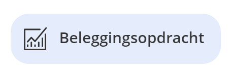
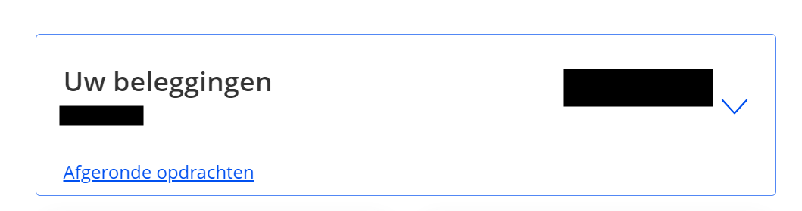
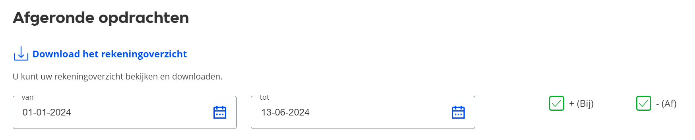

# Centraal Beheer 

# How to get the files

 1. Log into your Centraal Beheer account.
 1. Navigate to the "Beleggingsopdracht" section.
   
 1. Click on the "Bekijken" link.
   
 1. Click on the "Afgeronde opdrachten".
   
 1. Select the desired filters and the date range for the transactions.
   
 1. Click on the "Download het rekeningsoverzicht" button to start the print.
 1. Print to PDF without headers and footers.

 

## Example of content of the files

See test files in the repository.

# Known limitations
Dividends are not yet supported