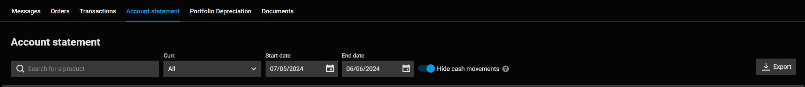

# DEGIRO 
![Logo](data:image/png;base64,iVBORw0KGgoAAAANSUhEUgAAAOEAAADhCAMAAAAJbSJIAAAAkFBMVEX///8MEhIAnN8AAAAAlt3R5/efoKAAmd6ez+9tuejR0tLBwsKoqalmaGje39+53PP5+fkDDAyYmZkgIyN3eXnx8fG2t7eKjIza2tqDhIRbXV1AQkLm5ubt7e1yc3O5urrGx8crLi5HSUkAkNwyNTWkpaVQUlIaHh5+gIAoKyvt9vyRk5NWWFivsLAVGhrb7fkI10ekAAAEn0lEQVR4nO3Za3uiOByGcbrpuDtUW7AeUClai+241pnv/+1WyD8kaIB6jeybuX+vLIckD4ccaBAAAAAAAAAAAAAAAAAAAAAAAAAAAAAAAAAAAAAAAAAAAP4A/367ij7pJawkaXRWYhJ6pO4R0/UhWy6z+ay+VR9ZFueeelmDbsPMV4jH09v9Fd70STtVsxy4tSyVx8LuX6/s5nxmtz/oTUnx+/z05eCl3uxjbnfuh+0J7/+6wr0+aajuHHHR1IeqxFFtp6bmZm/yrJR76v7RJiyPLP8+L+JUQ+bcyU2s4lr9tvZeEupaVtOvJNy5TdMnmta1JSxDVg/K4rKQSe8JixYk3QnHZl9x382+8EsJT6dIkzNfIcteEsp7EJv6Uidh7HsPN8pcjdVk8ilnmpZfJqzOlrMOtauk1HYy2VY750GD30ioksckCdfjlWRUe5swfj0OXfo+mQMX+ole6+ZJ4y4SqsWp/FMNx6VOEcfFrkf5Qx3KFzMam0LDHhKaMpJcrvnQJlx56jrIYVW/EH3EtqDLhGNz3IOcWHSoW/mdmJ2pPAp5Dwlt76arje/aE+qmqIHdkuincN2RMHhXJlUiATduIa038TYJp04ljQn1Wxh/uNtmpbAr4USZ4hf618gt5IfelvWZ0FQybksojdv5G9KaMI/NPnmuE/fMVLk9Vk8JN/bS6oTPPyaOsi/ZOhG+lLB6nOfyiJiHRfc51quO3TV/u8JlQqk5D/yjxapq9l3DlfYlHA13J+NMRoTi+iWeh7R6iDd9JgxsV+MZ8dW2fkhQzUKFN2E1HsqAW+x6cMeXih4i1Sy4maaE5Q3qSPhhEtrd8bM/4VkhxUO71gcd6u3Z6a3H/hOW78dX7+F1CZUebP33cPA/JJT38DXwv4e5bXZtjvblhCrTy6fQOzBIL+1fYXz7fpWmhFLzMqhGi2jqKo7J3R7PvIdtCZ1JqZKVy4u9ko7WXvrp/u8rNI4WB/t+NI6HmfsspevCw1I1J9TjoUxnPqUQmRfVFsRRay99o/FQKt60JTzq61/bk3UmTOvTtMzT1QzqF6GXhJkzq2hM+HI+8T75GXcllOmS6aE2ziRcRHJ5GwaLmySUNam+ss0z73e5DrZ1x7b3UBKaADKH09O2eG+LXbVO2n579RSlm4X0BlKHTpgnl9/aQnOcuYsD2dCasFpv687GrKR+ylIi2cuGprHiBmt807XLq9KyxjdLWbU/HNfDiTmzI2Gw1zdRPlRUheTj2cwuv98bAt7uO01sLmLLd5rIfvEws7Hu97C696azeVVOIWZGV1uT9ZJQVfPeti9RqTrbqVZxd8LgszbhC/LLCcGr96vx7RKerqWdR7V+TZzmtS+BalR8dulMaHphs5xa1C+UavuYGDy9XTPi+795q5HbUXd88z7G5vlUxVwzLR81nbCkE5bsoDeXYkwvnI5U9aVOqWXTkrP065+r6JPC8cAYrsOzD+6zgcfGOSCcv5dz1ay4LlFRVLnsfywLHZel6fLth5dIbxjboTSaTcr/Dqwmx2kAAAAAAAAAAAAAAAAAAAAAAAAAAAAAAAAAAAAAAAAAAPiT/AfhglryPrcecAAAAABJRU5ErkJggg==)

DEGIRO is a prominent European brokerage firm known for offering a wide range of investment opportunities to retail investors. Established in 2008 and headquartered in Amsterdam, DEGIRO provides access to various financial markets globally, including stocks, bonds, ETFs, options, and futures. The platform is renowned for its competitive low-cost fee structure, user-friendly interface, and robust trading tools, making it an attractive choice for both novice and experienced investors. DEGIRO's mission is to democratize access to financial markets by providing affordable and efficient investment solutions.

# How to get the files

 1. Log into your DEGIRO account.
 1. Navigate to the "Inbox" section.
 1. Click on the "Account Statements" tab.
 1. Select the desired filters and the date range for the transactions.
 1. Click on the "Export" button to save the account statement in CSV format.

 

## Example of content of the files

```csv
Datum,Tijd,Valutadatum,Product,ISIN,Omschrijving,FX,Mutatie,,Saldo,,Order Id
06-07-2023,09:39,06-07-2023,VANGUARD S&P500,IE00B3XXRP09,DEGIRO Transactiekosten en/of kosten van derden,,EUR,-1.00,EUR,21.70,b7ab0494-1b46-4e2f-9bd2-f79e6c87cb5a
06-07-2023,09:39,06-07-2023,VANGUARD S&P500,IE00B3XXRP09,"Koop 1 @ 77,3 EUR",,EUR,-77.30,EUR,21.70,b7ab0494-1b46-4e2f-9bd2-f79e6c87cb5a
```

# Known limitations
- Due to the limitations of the DEGIRO platform, the exported files contains language specific information. 
The parser is currently only able to parse Dutch and Portuguese files. If you have a file in another language, please open an issue and provide an example file so that the parser can be updated accordingly.