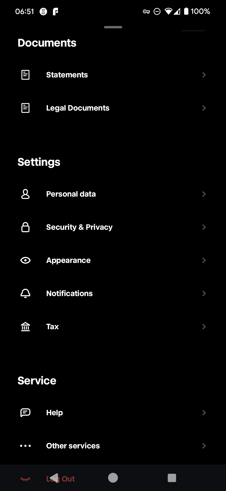
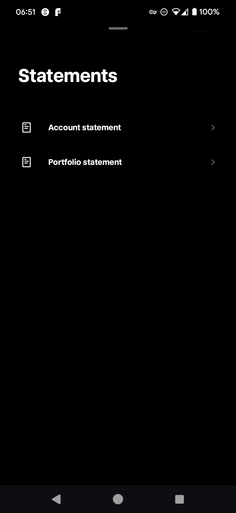
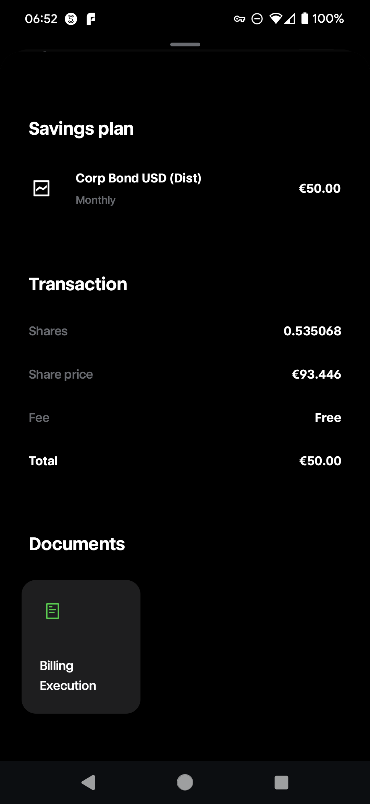

# Trade Republic
![Logo](data:image/png;base64,iVBORw0KGgoAAAANSUhEUgAAATYAAACjCAMAAAA3vsLfAAAAeFBMVEX///8ZGRkAAAAXFxcSEhK3t7ebm5urq6uLi4u7u7vv7+8UFBT39/evr6/a2to/Pz8LCwspKSnp6enh4eFmZmZ/f3+VlZVISEjNzc3U1NTCwsJvb29hYWGFhYWlpaU3NzdMTEwvLy8eHh5TU1Nzc3MyMjJSUlJCQkI7TpzfAAAKk0lEQVR4nO2diZKiMBCGMRwegKKogxeeM/P+b7iEdIckBAWrxJmd/qu2aiAJkM8c3Z3AOg6JRCKRSCQSiUQikUgkEolEIpFIJBKJRCKRSCQSiUQikUgkEolEIpF+rtJ4++5H+G2a5ktWKHv3c/wwTfPdPk+tSVEWXAtiiTsYML/nx/rB4liSAkvx77g2yE22o1mBzCuQcRE2oQLLB7QkLo+x83oKaWl8++TIBpUIm+Ms/NXRwCLIzQ9Zli8H9bQ/j2063NmwCIVMaYCEDTQJ9k1YHukvY7uw5Alifx4bexYaYSNsnUXYnhJhe0qE7SkRtqdE2J4SYXtKz2ILE8Y273749+kZbNxNvSwbAnJ/QzZspffe4HR5Rcr85v9lZFwmthLLyk8X/rJGruiXbDbaTvp7Op81aOE4U/1McjrYgvQBpkfaab3sfB+o7eBou6M+IjEDy/EgsUTbXXFCxEZcnnZdZ/rNXy6/YQxhKcemnXKLH/wyrl1hHkKJoXZaK+vygfpagZtZQmh2bCWWrzqW7Q1gL/Op0786YOMK2c64wAYzeR/aeVaLlCUV2HbYOOtknzfNi9noENeGsjS+ebPXN72O2IqEvX6BlczE+3Ula1nk1gLbNx/hLVia21a0yfcctNuD3dYZ24Dl2gWq+CsL1PP2soChBbZoq/0KjsBSzKXJbVtvTZPt+iSDwb1gc4Xw6eFQxeaWgwjW1GVq+W2FxzuqCUy5nsySfIlExJY0Twm6omz9BVj4aLccK+QW44O63NcLtjHzhOCmIRyKmVRU/HxYFTqx0PJUS8UWYGqXQuTFtYp6hnoWwJbsVpVuZutCTcaHbw1LSW7vc3LFUDavLdL06FxNWL3FALZkKQ7Tgah8cquyRGpfZGulMCAPy4v7c0/LAtjYQ0sr9W9n+9pVQe5UrjfX096AbaacM7Bhh1TzxJBFtNS5UhiweeIougjkMN0itqYGJm4vNnSEgyZ5DetaPwzbRG1BQqey/skOMCjDk44Npx4YGFtgC55d7vup2JRGtRBnWCrwsVVV2MCGvVn0yxbY6nbfb8WWw/FV5gjKM+EF/pCQnBo25+IqpBBbtkhR5gP9jnhbC2xDbDAjmeOMjQyysmpHnokNSU2Vg4Fifpi22K/HNnCPhT4ZVqQawRBWhp5pUrleJrYvdfirm7v/IbaBV1hzckJLTjLDSHRNPsyv4E9ZexPbFfslP/gb2FS5ilErhu3SjgPjhMkICWFT5SnDV6aiAoTS0W/C9oc6qUJtrkQgbsLKFaYYeFnS8Dexffy9KaGKpXpqGShySqfTabqGphdriVWBsxgcRRfHaTXeSpkP9Dy2PgJHqDvY3PNoNMLmoTwRxpw80Vzg4KRVu8KG1otmt93xSZ/DVkY2l/1FyB/ZbRCN9D6r5L11CQktfwMbtlzRGdt4CQ1YkkYftVzu2w17jZE/wpZitcdGiRq2QK22xLbTvP2nsHEs7m41twVEeIs/r/y7oYFX6KGXAG2riizldmyYQXf710hdBJ06d1JY7iuxTNdnjRyPdX70utxX6SE2XGqRBogtsF1mEHYdjnVBnq9vofQwtmpZlqWK9AeqsFmwpMGsJMeHMrYP3vey0GOf9NvTcsheWwlOiEikBMUDQDgehdBnLQaI+aaU8DrKVdDAtgq6yE/FHXseymp6jG2sNzc0OFabDASufngp0+8u37RZ8OP9cnB3FTR6S7/U1CICAuvI3rd6xJRqMbX+1gU/WIFpgy0+Wpb7fpxaYMM5oOxNG61pCaHXcOAHFmxMrvu2wPY71CZMCa5CuR6wwj6q5Ad33k2UzFKFq1Hl/Y+wCZ2Vc7h1Bt3zUTV4R7ZxXJ7ko5+5MSZZKV3u00ytTwm/Q9FQSHXnolyc2xrH+caZwJ/6dpmxTC/GpqEi31hiHw/ryt8/wJNIJBKJ1FnpOlAVb6LmxFLrMnKUaSn5eFovtZYGRQwlI8s1h5q/iddresx1pp27cqf2sg96jxdZtjzvszuJhUrj91A7fZuapQ544gwnytoNayVPMoSHht+g9pixeU1n+gUhAh4F2fcNrr6bMmFXbABji4ckVpBHZkrhBNz0S1aL91pQMq5d02MfYLJFtU0mTtM1h9om+6Tv94Vsm1CTBKrRARuv0zGyV/EBtuKac1GyPbZajFQu/fQj697dBJ67G7YBu1qr+BgbBn1bY9vUL8J6DbzZtzxDqLEjNljXaodNbNtFf1+ktcZ2lKEAGTDQdw6/WogNhlx4HNi9N9aqqE4JI70YRG/FulYrbMly7Pvx6AIjlOhjbbHJfdbF7CHRs/qbJq+TfJ5oUmj7oYVwAVuyKhNB5TAE2NiQpyxiuTV3WquiY8eG+3yh3Ygpsi02XGpkeeRE43JXT8KOfUZQ8HnwnQLcc1DWCrAp0z4KscEvjFtzy/c1OmHDzGUsriW2CBoYTAMpC4s+0G/YycSGpG7qwUNsOLOV1eqEbaPeoiW2jZEtYKO+g04mNthFJAb+9ti2Ss5O2PAWXcY2rYW+Rya2oUpqbAKQMrHFz7a2bzWtJbZAv8Q7ZGBbwIwuXioDbOHxtgMtIdJrYkMyudN2Jr1lWbYdHmHVppPdhjevu669yZf2QKH4gBaIWFpHAyRMUIhXx5bu1bW+LnYbpHx28hLkNP5KMPfla7VAGwheVqmbu/gLw5O7l3MhF/1DsfzX2UvwcGdVS2wHdTx8jxq8BLH49hDbwA0LuXpqZ2wJNptfjs2Y5u5g06v/qV6yg0/K4MXnX40tlFMUYnM9lDG26dQgcNIOG4bWxIFYiu04tv0obO5RLo+PcQQ7fYBmENeqY6uiZu0MkAN3y1K5762coX/flFDNB2710A/tNpxji8Izv7HUPbsN7GTxHldLbLjZKahl602+rEU0YarNxvXQSwhnV67lSN0chB6DNOLRYS3nSwOb3LnE/26Jbdj4a/Ym1dxFFjKU/9i5sn0sHnbcyACYfCeyPDKxXZOqKbbEhq8DnyAxW/W+BqNiW2D9cKxt75OqkpggKAG+ENiCJrZP5X2Flthws7X8zoO2btSLNOcKt3PjprX2PqkmiKG5YRmnxpgiXMUeARG7n9vG2464H7bs9jvGrfXPuM/v9WjY5MsDMLyjT/q5rLQvc97FFqDdwq6jEQY+0YTWsE38BD9VxA+xnYb6CqRjYsMFGI/d1ivYTu316tnrrjwEKT3Y5SbttqSSFhS3Y6s+15BUO+Fxw6Fht2FEe6UXVJTUscl8fEu0i79RnzE3HZvsUALHwyWYhvh9YCmHmyWtK1cwTNmxLZ2aLWi5Qb/miBE4gkUBmAWfxeac6l4ZdiH7gp9IbY2tfgN2tT3Hy2Rgk11IXYLpjs2slltNxrYICDJtjy2a6VnZ6RVwmgXfOJJNnHnlcVKORGP8AJIiHNvEQeMi21r57onHkipfrF+Tf8nnA62HyHI/F7CJ+1Vz+qpaZC1mkL4t3zEMzRgpld/+40PRtrbNhcFWjzUcNP/fSIv1BUt8q86jvh3Hne2UL3BGzKad8pjKbJkecPl2MOp/y9ELtcj8YexvXmdPpdt4GNc+WEYikUgkEolEIpFIJBKJRCKRSCQSiUQikUgkEolEIpFIJBKJRCKRSP+X/gH/SZvBl6ex7wAAAABJRU5ErkJggg==)

Trade Republic is a European neobroker and financial technology company that offers a commission-free trading platform. Launched in 2015 and headquartered in Berlin, Germany, it provides users with the ability to trade a wide range of financial instruments, including stocks, ETFs, and derivatives, through a mobile app. The company aims to democratize access to financial markets by removing traditional barriers such as high fees and complex interfaces.

Key features of Trade Republic include:

1. **Commission-Free Trading**: Users can trade securities without paying commission fees, which is a significant shift from traditional brokerage models that often charge per trade.
2. **User-Friendly Mobile App**: The platform is designed for ease of use, catering to both novice and experienced traders with a streamlined and intuitive interface.
3. **Extensive Market Access**: Trade Republic offers access to a wide variety of financial products, including stocks from major exchanges, ETFs, and derivatives like options and futures.
4. **Savings Plans**: Users can set up automated savings plans, allowing for regular investments in selected ETFs or stocks.
5. **Regulation and Security**: As a licensed securities trading bank, Trade Republic is regulated by the Federal Financial Supervisory Authority (BaFin) and the Deutsche Bundesbank, ensuring a high level of security and compliance with European financial regulations.

Trade Republic has experienced rapid growth and has attracted significant investment, reflecting the increasing demand for accessible and affordable trading solutions. It is part of a broader trend of fintech companies disrupting traditional financial services by leveraging technology to provide more efficient and user-friendly alternatives.

# How to get the files

## Account statement
 1. Log into your Trade Republic account.
 1. Click on the "Statements" link.
 1. Navigate to the "Documents" section in the overview.
   
 1. Click on the "Account statement".
   
 1. Select the desired date range for the transactions.
 1. Download the account statement in PDF format

## Individual invoide
 1. Log into your Trade Republic account.
 1. Find the desired Transaction.
 1. Navigate to the "Documents" section.
 1. Click on the "Billing Execution"
   
 1. Download the account statement in PDF format

## Example of content of the files

See test files in the repository.

# Known limitations
- Due to the limitations of the Trade Republic platform, the exported files contains language specific information. 
The parser is currently only able to parse Dutch files. If you have a file in another language, please open an issue and provide an example file so that the parser can be updated accordingly.