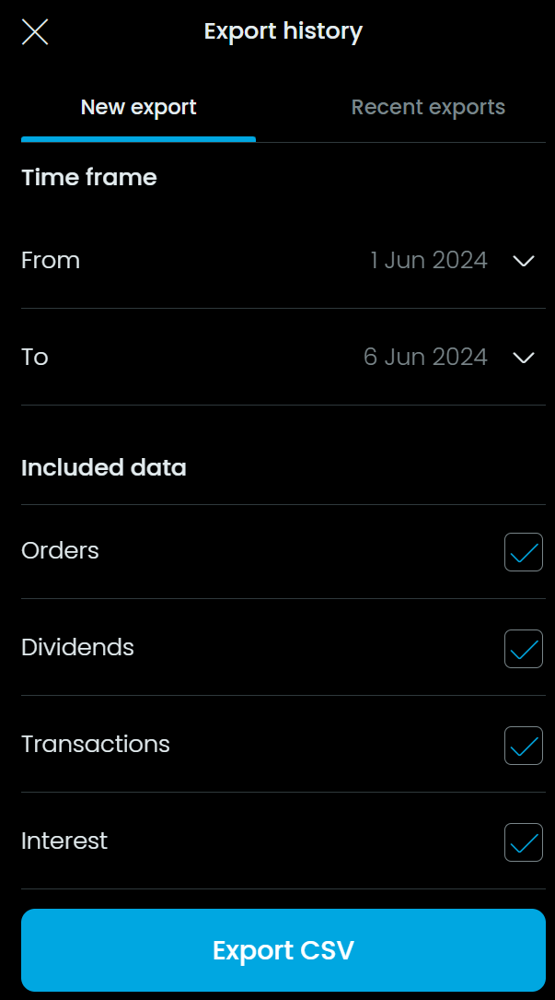

# Trading212 
![Logo](data:image/png;base64,iVBORw0KGgoAAAANSUhEUgAAATYAAACjCAMAAAA3vsLfAAAA8FBMVEUNERL///8NERQMEhIAAAD///0DCgsrLi0LDxDr7O1wcXI1NjcACAwAAAdPT0/KzM07PD7V1tY5Ozrl5ucCp+H39/gAAwDf4eDz9PULEw6vsLENAAAQDxSHiIjCw8MKEhQXGxq4ubstLS9mZ2lGR0kPTl+SlJMdHiAAp+YQEA4jJSSgoaJ7fXwIAwAWFxpWV1gJHCYYSFsKMkBcXV+Njo4lfp8jm84UXYAKrOAZl8ACExoDHy8RTWkZZ4qjp6cdm8oXWHAKmtcGEB8IO1sWhqgbdJoUcY4Up9QbmskON04jgp4LKTQSPU0SDQEFFg8SDRnOqPAXAAAJ7klEQVR4nO2caXvauBaAjX0QYnGAAGEzJCyXsCWdNp2Wbmnv3Gk7d5np//83V9KRbHkjyzjt3Oee90OLbSHLL0fSkeCJ4xKPwPnRDfjfhLQ9CtL2KEjbo3AIgiAIgiAIgiAIgiAIgiAIgiAIgiAIgiAIgiAIgiAIgiAIgiAIgiAIgiAIgiAIgiAej+s6nucGQeCen3uF132vP5DwkD+h8OP+2gLn9tHQEcqGkntKi789dTFx+Whp+22Zp4NksaI/WKwWMmAOd+In4to2weZqLNkMNw42i/vx8tYbmDrFo7s1oouNRO12JXn6eE4RjtccHp3gzCrrOPf6PO4Dh0UtzZy5sIwOF8/m5rkV597mp+d/E7xwvY1zjs97YpevW+V5RZ57BvIlu5GvlxBaUu9qGY8Ay5ezZlvQnK5OssVxcGsjWabZHNWurVYpSY39HqKyDC73uuxtjUNh1hxolTJoggOd2JnB9AbC9gRB4+f1et3tvvrJHQZKG+elRPmFEQdNdWbORGzpu9XBKFCHHdBHtbZdR2eS8aAAu15UpDdqmFZ5IrCWI3ENTDcVnkZW2cEOIFXdI2GZ2trAoZo62TJPEWxedIU0wetx4GxUEy9SlfRboEZiQBf1huv6J+Zj2WBFqK0K2L9GySqmyXhzYYsfZ1mi3ouhKzrnfNUX50ulM/MWOK2GRcvyUr9y9v21lXpL7W0Inw/KWvfNWw/nUn5RTpdvQY620sLEV6SNwy7dkFE83jjXlUXaSoOt6OLAaxjTljbOqlFRLNsvqp+y5f21ic6Ed928e4XWuof3Y8dFbdnV8Gxtsv08ro1VslqyjPcrmKSLzMBj9YE+KJfKRpv4GFIf5aqgbsouO1UF3gFfD1ahNnUcDhB6sBl/UCObCjc/CGxt6u1hKxeQo03XZGuDlX7w2WoyWc30PW9j8REGW3U3mexM4F0yqJl6I20cBqitL8v2S+ZOxeQjZobGGK/oI0drG+Dhqe4/TRxH3n7smmg7PGd2tPWx/HJmAsHJ1lYuN3gi2nQLOnWdwvR1hXZj+RzfPsUyNRRVgwxtnOl7jbCs/lCWRc0KXKEbLVIBj+MDKW09wKvwUj6qsMjF1Ol/OqzF2PZ38e+6+xnDgRltqrwPM33o5kSbeBonoa2jwxCbBc9KugFWW+EGT17qaWCqDncxbT0dbbo/V03CiK3YFzaZ4k20Nmay11CbPuypYXXOAi/45Y2Is/XhH29kT/36YhPXZj/0ILeTiltBTJvsU6pYmJtgN23EtKGKNk7RjvwwMZ6ktuaiE9N2qwNeH45+iLaOjLZS/Sxw/Pcy2Na/ggg6oe/zVYY2fhnFSo62pgzMlLaeWTPp8BjE1ic6qnaAs7e2OIJGq73aAnTsmVQ73WNZR8/T31tb1Wjj/q8yaTs8H4uoE1PDx3cbL63t+k5tMgmxtTUw2sJOya5bguv4sg7m4pwIyJiKW3CZXBCiNjMleFDHsrqTzr67Nlc0t6y0bZlIdVWQvfG98RcRdIfuhyvPjaaE+2jDSVqkM7Y2X2tjpkm8IUjmWY2G74sVs2wkNzWvMJtx4tHmOYwxXQF3TWZQK3CFdUybZmqej1/9LGfQ9acrd/Puq/DW/e3tMPAepG2Cw5YY/S1tZ3gSUts8XlbK4AoRODuWSzdmFomNbbHSYFYgrUaR1nK1LST7W71AFYudzYtX0tWbX/jboS8MHkTKe/XN3TxIGw47A7GMtLSZTiq02dsgGdq42tjQC9hyz2VHtKmy3r5f6uGdCrWWpy2B+FzHX8T8uT58GbvBMPjn1+7h6/q3RhAMH6Jtpyovyymwl6UNVlPDTuSnCW0yH4LFLEyqwwVYlja5kVSbhvl6UauEB2kTk7laV627H98NneBczQ5ipHsfBA+aEkYmz2rhXRLaTC6i2LK4NhE8/r5pbWxUL8xomNbG4DpWtp+7h1esttiiTqYM7JOIte7Xz2PuBW4QiFxkvT78y3+YNpHkt3WN/VAbWNFWVXdWmeKl/ZyemAbc3UA1TC/PO/Vo8y42Jcgqt2rjyGyAlNoXrFhrudEWeetM5CS3+ffr1x8+vH4XDFUp9kkcvP5PsPnjIdqaYvmFNZ+0Q22NuDZDXJsDi9i2Rm93Fk2NWptpAod9LyoqljgrSE3MT6/tRjXH26jN8N9/xz1d52o8vroaBpsHjW0ibHUa1Z6G2nxLm9VJ49pgj0O7yoZKfZHjWpd13qZXUzzcG8CykyJ3d+/QphIQbGpT3TXw/vAC79zzMEkQh8437zwIkgmIq7U5OdrYFh8/mhK0K19q248EvbQ239odbL+sQ5TkRdrCxdVNKfzgm5M5PIG0Y+kuN4F3ioOIuB58EytTdbBxh0Nx5HqJsY3doU3tE4WRbEebHyYg1ZQ2s3YXI8ZqnnCW1MZx2BQn2pOtdPYk3/kdWyVEaxjHOReR5Q3DXEoeKUJteIFt79LG9bifjDYHlyXhKHFtfwWGtZZ6e4CGm/oCNKYN9P7rYCHLPtWfpj+mrYH7roNjk7feFDfaYBH6yNUWbvZobZhSmw0xhpsBIvqiBARrLZeXmR1O12C04TJ/sC04U4tzdE2qLx5bBofazsRKEEyC0c6Ptmin1mjDTrUz3zLsTbxa2lDFFM7kXQxyd1D+f6bFi94rzul9ox0wFi/7HbXdaAn5d9VTQmd+KjiZ6D3o29wpwYm6kQlKHLd6NVxU3QyMeEsbzo236iaGui9G37p8VcFoOz1t1cOpelWxy1aKnheObxwlOlCuNishV8G39PMSEEd+2zeLadvro05zNmuab2l3GdoSTEAPCRbCvazcfGMVsniyxZWT1sb1lt8s/6ZmKIqBO6s5nVT0rHnP0sb5IP5ulaPW7Vtma7uF9PdZL422xEJn8jTaTjO1OexaLVJKl7mDA7tOP0/fU7XlaYs04H6/NUcYbWorLYTfX9sEwlBOnH8SbeF2VGJ3V21XlY9sIPC0tlvAyvK1hd8q6pjex95fLsWt/SW1qW28QZRc4sOGX6m0evI58nspZ/ZvRgad6ctL80MifIDqhchjGxXVLXemGj0ohdFXH1kdtTdLJBqh1/iApca2+KnyArIVL4qdE7jDKoJoh0AsDuYCN9yUuZzPK5UjmRu7lgUU2wsPMB9FGvKCx2TCyS7Ey3n44xZRbUXcxaRmrg9wst/JldVu8oyDn2wlbCtpwOFnifNyqQoZRYtP4ngyr+Hx47vSHs7t9CgeJdZ7k9Ukjnneb9fsmhLwjPNZ554ib8NWHfnh3J+8YUHtvWc1BW9G3nEz58/+PuK7NvcIGc34qzSNIAiCIAiCIAiCIAiCIAiCIAiCIAiCIAiCIAiCIAiCIAiCIAiCIAiCIAiCIAiCIAiCIAiCIAiCIAiC+L/HIx4BaXsUpO1R/Bcs+OeWrz4JdAAAAABJRU5ErkJggg==)

Trading212 is a popular fintech company and online brokerage firm that offers a versatile platform for trading and investing in various financial instruments, including stocks, ETFs, forex, and cryptocurrencies. Founded in 2006 and based in London, Trading212 has gained a strong reputation for its commission-free trading model, making investing more accessible and cost-effective for retail investors. The platform is known for its intuitive mobile app, comprehensive educational resources, and innovative features such as fractional shares, which allow users to invest in high-value stocks with smaller amounts of money. Trading212 aims to democratize investing by providing a seamless and user-friendly experience to investors of all levels.

# How to get the files

 1. Log into your Trading212 account.
 1. Navigate via de menu to the "History" option.
 1. Press the "Export" button.
 1. Select the desired filters and the date range for the transactions.
 1. Click on the "Export" button to save the account statement in CSV format.

  

## Example of content of the files

```csv
Action,Time,ISIN,Ticker,Name,No. of shares,Price / share,Currency (Price / share),Exchange rate,Currency (Result),Total,Currency (Total),Notes,ID,Currency conversion fee,Currency (Currency conversion fee)
Market buy,2023-08-07 19:56:02,US67066G1040,NVDA,"NVIDIA",0.0267001000,453.33,USD,1.10047,"EUR",11.02,"EUR",,EOF3219953148,0.02,"EUR"
```

# Known limitations
- Conversions of currencies are currently not correctly supported